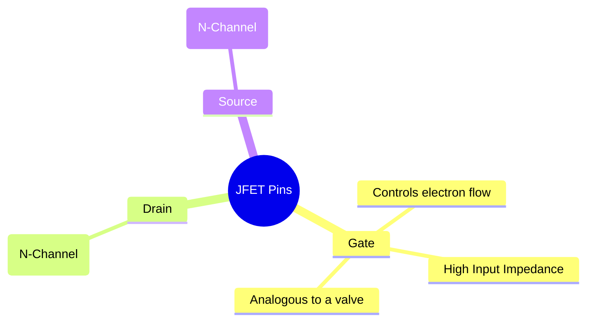

До массового распространения МОП-транзисторов **JFET** (переходный полевой транзистор) был королем усиления с высоким входным сопротивлением. Хотя они не так часто используются в современной цифровой логике, они остаются незаменимыми артефактами в высококачественных предусилителях звука, чувствительных приборах и радиочастотных схемах.

Понимание условного обозначения JFET необходимо для всех, кто занимается проектированием дискретных аналоговых схем.

## 1. Анатомия символа JFET

В отличие от биполярных транзисторов (BJT), которые являются устройствами с управлением по току, JFET является устройством, управляемым **напряжением**. Схематический символ пытается визуально представить физическую конструкцию внутреннего полупроводникового канала.

Символ состоит из прямой вертикальной линии, обозначающей канал, с двумя соединяющимися с ним горизонтальными линиями (Сток и Источник). Третья перпендикулярная линия образует Ворота со стрелкой, определяющей полярность полупроводника.

### N-канальные и P-канальные JFET

Точно так же, как BJT имеют NPN и PNP, JFET бывают двух разных разновидностей.

| Характеристика | N-канальный JFET | P-канальный JFET |
| :--- | :--- | :--- |
| **Символ Стрелка** | Указывает **IN** на линию канала | Точки **OUT** вдали от канала |
| **Основные операторы связи** | Электроны | Отверстия |
| **Vgs для Pinch-Off** | Отрицательное напряжение (например, -5 В) | Положительное напряжение (например, +5 В) |
| **Типичная операция**| Обычно ВКЛ -> Примените массив отрицательного напряжения для выключения | Обычно ВКЛ -> Примените массив положительного напряжения для выключения |

> **Трюк с памятью:** «Указание внутрь» означает **N**-канал. Посмотрите на стрелу на Воротах. Если он направлен внутрь линии, вы имеете дело с N-канальным JFET (например, популярным 2N5457).

## 2. Операция: Режим истощения

Одной из наиболее определяющих характеристик JFET является то, что это устройство работает в **режиме истощения**. Это сильно влияет на то, как вы проектируете схемы на их основе.

* **МОП-транзисторы (режим улучшения):** обычно выключены. Вы должны подать напряжение на ворота, чтобы включить их.
* **JFET (режим истощения):** обычно включены. При 0 В на затворе максимальный ток течет от стока к истоку. Вы должны применить напряжение *обратного смещения* (отрицательное для N-канала), чтобы расширить область истощения и буквально «перехватить» поток электронов, выключив устройство.

```mermaid
flowchart LR
    VGS[V_GS = 0V] --> I1[Maximum Drain Current flows]
    VGS2[V_GS = -2V] --> I2[Current is restricted]
    VGS3[V_GS = -5V] --> I3[Pinch-Off reached. Circuit is OFF]
    
    style VGS fill:#1e293b,stroke:#f59e0b
    style VGS3 fill:#1e293b,stroke:#ef4444
```

## 3. Типичные схемы применения

Поскольку во время работы затвор JFET смещен в обратном направлении, в него протекает практически нулевой ток. Это дает астрономически высокий входной импеданс (часто измеряемый сотнями мегаом).

| Применение схемы | Почему выбирают JFET | Схематические подсказки |
| :--- | :--- | :--- |
| **Аудиопредусилители** | Чрезвычайно низкий уровень шума и большое входное сопротивление предотвращают нагрузку на чувствительные звукосниматели электрогитары. | Часто рассматривается как буферный этап Source Follower. |
| **Аналоговые переключатели** | Поскольку они управляются исключительно напряжением, без тока затвора, они вводят нулевые переходные процессы переключения в тракт сигнала. | Размещен последовательно с аналоговым сигналом, проходящим через канал сток-исток. |
| **Источники постоянного тока** | JFET изначально ведет себя как приемник постоянного тока, когда затвор подключен непосредственно к источнику. | Терминал Gate подключен непосредственно к терминалу источника. |

При построении диаграмм этих специализированных аналоговых схем точность является ключевым моментом. Убедитесь, что стрелка ворот ориентирована правильно, чтобы предотвратить производственные сбои. Используйте тщательно подобранную библиотеку дискретных полупроводников в **[Создании схематических схем](/editor/)**, чтобы точно разместить стандартные символы N-Channel и P-Channel JFET на следующем холсте.