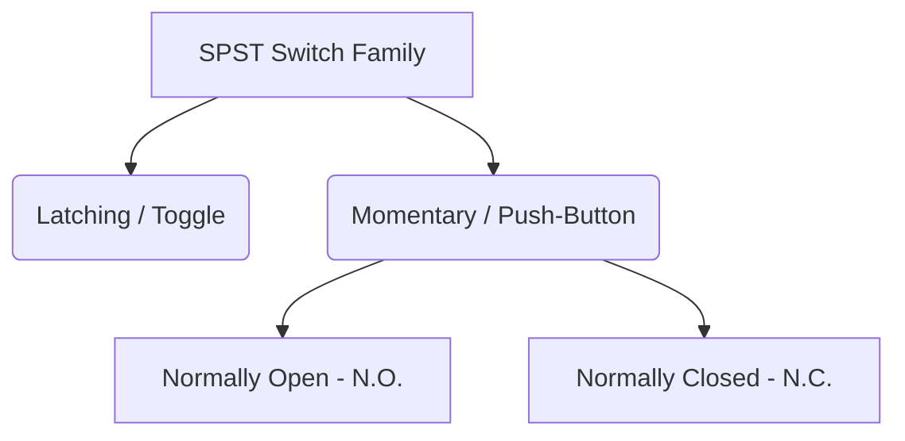

В основе каждого интерфейса, который люди используют для управления электричеством, лежит механический переключатель. Самым простым и распространенным вариантом этого компонента является **SPST**, или однополюсный однопозиционный переключатель.

Независимо от того, разрабатываете ли вы высоковольтный сетевой выключатель или просто намечаете кнопку на макете Arduino, символ SPST является вашей логической отправной точкой.

## 1. Что на самом деле означает SPST

Инженеры классифицируют переключатели, используя две переменные: **Полюсы** и **Выходы**.

* **Полюс (P):** Количество независимых электрических цепей, которыми переключатель может управлять одновременно. 
* **Throw (T):** количество закрытых состояний (положений ВКЛ.), которые имеет каждый полюс.

Таким образом, SPST является *однополюсным* (управляет одной цепью) и *одноходовым* (имеет только одно закрытое проводящее положение).

```mermaid
flowchart LR
    A[Human Input] --> B((SPST Mechanism))
    B -- Open / Default --> C[Infinite Resistance / OFF]
    B -- Closed / Actuated --> D[Zero Resistance / ON]
    
    style B fill:#0f172a,stroke:#f59e0b
```

## 2. Чтение условного обозначения SPST

Стандартный символ IEEE для переключателя SPST очень интуитивно понятен — он буквально выглядит так, как он делает.

| Визуальный элемент | Значение в реальном мире |
| :--- | :--- |
| **Два открытых круга** | Стационарные электрические контактные площадки, на которых заканчиваются провода. |
| **Диагональная пунктирная линия** | Механический проводящий рычаг, физически отделенный от второй площадки, что указывает на состояние «Открыто» по умолчанию. |
| **Обозначение (`S` или `SW`)** | Стандартные справочные теги. например, `SW1`. |

> **Предположение о нормальном состоянии:** Если не указано иное, механические переключатели изображаются в **неактивном состоянии**. Для стандартного переключателя света SPST это означает, что на схеме он изображен в положении ВЫКЛ.

## 3. Варианты SPST: кнопки

Тумблер остается там, где вы его положили (фиксируется). Кнопка срабатывает только тогда, когда на ней находится ваш палец (мгновенно). Обозначение SPST применимо к обоим, но символы немного меняются, чтобы различать режимы взаимодействия человека.

| Тип переключателя | Схематическое изменение | Реальный пример |
| :--- | :--- | :--- |
| **Кнопка (Н.О.)** | Вместо наклонного рычага над двумя контактными площадками парит плоский мост. Нажатие вниз устраняет разрыв. | Клавиши клавиатуры, кнопки питания компьютера, кнопки дверного звонка. |
| **Кнопка (НЗ)** | Плоский мост лежит *под* или касается контактных площадок, сохраняя цепь включенной по умолчанию. Нажатие вниз разрывает связи. | Кнопки аварийной остановки (E-Stop) на тяжелой технике. |

## 4. Предупреждения аппаратной реализации

При включении переключателя SPST в цифровую логическую схему (например, вывод GPIO Raspberry Pi) наивная схематическая конструкция приведет к катастрофически непредсказуемому поведению программного обеспечения.

### Проблема «плавающего штифта»

Если вы подключите одну сторону переключателя SPST к 5 В, а другую сторону напрямую к выводу микроконтроллера, что произойдет, когда переключатель разомкнут? На выводе не отображается напряжение 0 В — он отключен и «плавает», действуя как антенна, улавливающая окружающий электромагнетизм.

**Исправление: понижающие резисторы**

Всегда включайте резистор (обычно 10 кОм), подключенный между цифровым выводом и землей.

1. **Выключение:** Вывод надежно считывает 0 В через резистор.
2. **Включение:** Источник питания 5 В перегружает резистор, вызывая безопасное ВЫСОКОЕ состояние.

Надежно включайте варианты SPST в свои проекты с помощью **[Редактора принципиальных схем](/editor/)**. Разверните левую библиотеку «Переключатели», чтобы найти Н.О. и реализации NC!