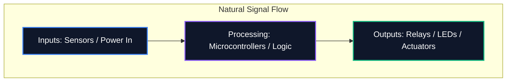

Oavsett om du delar ett diagram på ett forum eller skickar in det för professionell PCB-tillverkning, är läsbarheten av ditt schema lika viktigt som dess logiska korrekthet. Ett rörigt schema leder till routingfel, missförstådda komponenter och slöseri med tid.

Den här guiden beskriver de bästa praxis som används av professionella elektronikingenjörer för att skapa rena, underhållbara och mycket läsbara kretsscheman.

## 1. Schematiskt flöde: från vänster till höger, uppifrån och ned

Ett schema är ett tekniskt dokument, och som alla dokument bör det läsas naturligt. Inom elektronikdesign föreskriver standardkonventionen att ingångar flyter från vänster och utgångar går ut till höger.

På samma sätt bör högre spänningar uttryckligen placeras överst i schemat och lägre spänningar eller jord längst ner.



## 2. Kraft- och marksymboler

Dra aldrig långa, slingrande ledningar som kopplar samman varenda jordstift. Det skapar ett spindelnät som är omöjligt att läsa. Använd istället lokala ström- och jordsymboler vid komponenten.

| Dålig praxis | Bästa praxis | Varför det spelar roll |
| :--- | :--- | :--- |
| Koppla all jord med en enda kontinuerlig tråd | Använda lokala "GND"-symboler vid varje komponent | Minskar visuell röran; definierar uttryckligen returvägar utan komplex spårning |
| Placera VCC-linjer som korsar signalspår | Använda lokala `VCC` / `+5V`-symboler som pekar uppåt | Förhindrar att signallinjer visuellt förväxlas med strömförsörjning |
| Märkning av olika grunder med samma symbol | Differentiering av analog jord (AGND) och digital jord (DGND) | Critical for avoiding ground loops and noise propagation in mixed-signal designs |

## 3. Junction Dots vs Crossings

Ett av de farligaste misstagen i schematisk design är tvetydighet där ledningar korsar.

```mermaid
graph TD
    A[Is it a connection?]
    A --> B{Is there a junction dot?}
    B -- Yes --> C[Wires are electrically connected (Node)]
    B -- No --> D[Wires are crossing without connecting]
    
    style A fill:#1e293b,stroke:#f59e0b
    style C fill:#1e293b,stroke:#10b981
    style D fill:#1e293b,stroke:#ef4444
```

> **Proffstips:** Använd aldrig "4-vägs"-korsningar (ett kors format som ett "+"). Om fyra ledningar behöver mötas, förskjut dem i två 3-vägs T-korsningar. Detta eliminerar helt oklarheter; om kopplingspunkten försvinner vid utskrift eller skalning, innebär 'T'-formen fortfarande entydigt en koppling, medan ett blankt kors inte gör det.

## 4. Logisk komponentgruppering

När man har att göra med stora scheman som innehåller mikrokontroller med 64+ stift, är det en meningslös övning att försöka dra varje ledning fysiskt till komponenten. Istället använder professionella verktyg **Net Labels**.

Gruppera funktionella block av din krets i visuella zoner. Sätt till exempel strömförsörjningen i ett hörn, MCU:n i mitten och motordrivrutiner i ett annat. Anslut dem enbart med beskrivande nätetiketter (t.ex. "SPI_MOSI", "UART_TX", "MOTOR_PWM").

## 5. Referensbeteckningar och värden

En blottad motståndssymbol säger ingenting för tittaren. Varje komponent måste ha en unik referensbeteckning och ett explicit värde.

| Komponentkategori | Standardprefix | Exempel |
| :--- | :--- | :--- |
| **Motstånd** | `R` | `R1 (10kΩ)` |
| **Kondensatorer** | `C` | `C4 (100nF)` |
| **Integrerade kretsar** | `U` eller `IC` | `U2 (LM358)` |
| **Dioder / lysdioder** | `D` | `D1 (1N4148)` |
| **Transistorer / MOSFETs** | `Q` | `Q1 (2N2222)` |
| **Induktorer** | `L` | `L1 (4,7μH)` |
| **Anslutningar/huvuden** | "J" eller "P" | `J1 (Power Jack)` |

Att följa dessa konventioner garanterar att ditt schema omedelbart kommer att förstås av alla ingenjörer, var som helst i världen. Börja tillämpa dessa regler idag i [Circuit Diagram Editor](/editor/).