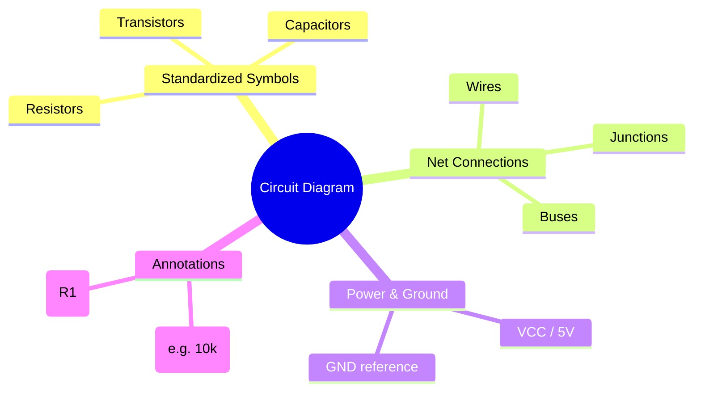
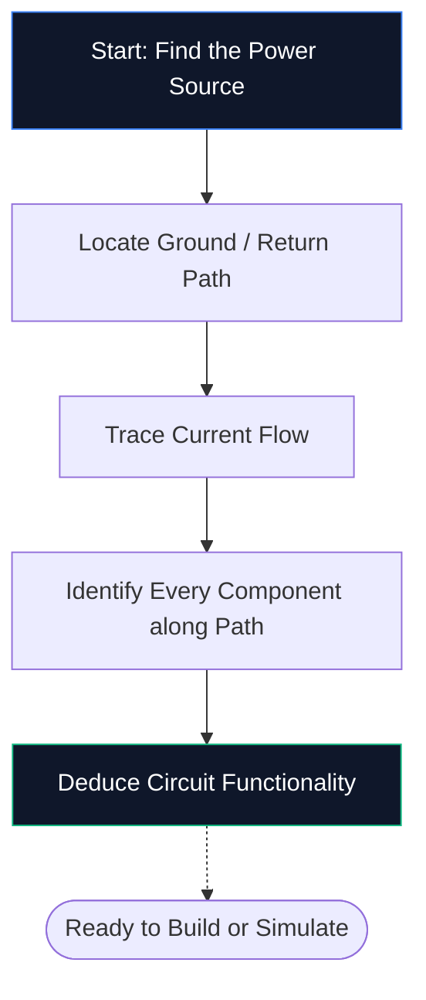

Om du aldrig har öppnat en schematisk editor tidigare, är detta den enda guiden du behöver. Vi kommer att gå igenom grunderna – vad ett kretsschema är, hur man avkodar symbolerna och hur man ritar ditt allra första schema inuti **Circuit Diagram Maker** – allt utan att installera en enda mjukvara.

## Vad är egentligen ett kretsdiagram?

Ett kretsschema är en karta för el. Precis som en tunnelbanekarta visar hur stationer ansluter utan att avbilda tunnlarna i skalen, visar ett kretsschema hur elektroniska komponenter ansluter utan att oroa sig för fysisk storlek eller kortplacering.

Istället för realistiska ritningar använder scheman **standardiserade symboler**. Ett motstånd visas som en sicksacklinje, en kondensator som två parallella plattor och en diod som en triangel som möter en stav. Denna universella stenografi håller diagram rena, utskrivbara och läsbara i alla länder och språk.

> **Varför abstraktioner spelar roll:** Ett fysiskt motstånd är en liten cylinder med färgade band, men på ett 50-komponentsschema skulle den detaljen skapa visuellt kaos. Symboler komprimerar bilden så att din hjärna kan fokusera på *hur saker hänger ihop* snarare än *hur de ser ut*.

## De 10 symbolerna du måste känna till för alla nybörjare

Innan du kan läsa - eller rita - ett enda schema måste du känna igen de centrala byggstenarna. Memorera tabellen nedan så kommer du att kunna avkoda de flesta hobbykretsar på sikt.

| Symbol Form | Komponent | Primär funktion | Beteckning |
| :--- | :--- | :--- | :--- |
| **Sicksacklinje** | Motstånd | Begränsar strömflödet | `R` |
| **Två parallella linjer** | Kondensator | Lagrar avgift, filtrerar buller | `C` |
| **Series av slingor** | Induktor | Lagrar energi i ett magnetfält | `L` |
| **Triangel + stapel** | Diod | Tillåter ström i en riktning | `D` |
| **Triangel + stapel + pilar** | LED | Avger ljus när det är framåtriktat | `D` / `LED` |
| **Långa / korta parallella linjer** | Batteri | Ger DC-spänning | `BT` |
| **Tre staplade rader** | Mark | Referenspunkt vid 0 V | `GND` |
| **Triangelform** | Op-Amp | Förstärker spänningsskillnaden | `U` / `IC` |
| **Rektangel med stift** | Integrerad krets | Utför komplexa funktioner | `U` / `IC` |
| **Raka linjer** | Ledningar | Bär ström mellan komponenterna | *(Inga)* |

## Hur man läser ett schema i fem steg

Att läsa ett kretsschema följer samma mentala process varje gång. Öva dessa fem steg på vilket schema som helst och mönstret kommer att bli andra natur.

1. **Hitta strömkällan** — Leta efter en batterisymbol eller etiketter som VCC, 5 V eller 3,3 V. Det är här elektrisk energi kommer in i kretsen.
2. **Loka in mark** — Hitta den treradiga marksymbolen eller en GND-etikett. Varje krets måste ha en returväg.
3. **Spåra strömflöde** — Följ ledningarna från den positiva terminalen, genom varje komponent och tillbaka till jord. Konventionell ström flyter från positiv till negativ.
4. **Identifiera varje komponent** — Matcha varje symbol med tabellen ovan och läs sedan etiketten bredvid den för exakta värden (till exempel betyder 10 kΩ 10 000 ohm).
5. **Förstå syftet** — Fråga dig själv vad kretsen gör. En LED plus ett motstånd är en enkel indikatorlampa. En op-amp med återkopplingsmotstånd är en signalförstärkare.

## Ditt första schema: LED-kretsen

Varje nybörjare inom elektronik börjar här - en lysdiod som drivs av ett strömbegränsande motstånd. Öppna [Circuit Diagram Maker editor](/editor/) och följ med.

**Circuit Architecture Pipeline:**

```mermaid
graph LR
    PWR(Battery 9V) -- Positive Wire --> R1(Resistor 330Ω)
    R1 -- Controlled Current --> D1((Red LED))
    D1 -- Return Path --> GND(Ground)
    
    style PWR fill:#1e293b,stroke:#f59e0b
    style R1 fill:#1e293b,stroke:#3b82f6
    style D1 fill:#1e293b,stroke:#ef4444
    style GND fill:#1e293b,stroke:#64748b
```

**Steg-för-steg-instruktioner:**

1. Dra en **Batteri**-symbol från sidofältet till arbetsytan.
2. Placera ett **motstånd** till höger om batteriet.
3. Placera en **LED** till höger om motståndet.
4. Tryck på **W** för att aktivera trådläget.
5. Klicka på batteriets pluspol och klicka sedan på motståndets vänstra stift för att dra en tråd.
6. Anslut motståndets högra stift till LED-anoden.
7. Koppla tillbaka LED-katoden till batteriets minuspol.
8. Dubbelklicka på motståndet och skriv **330 Ω**.
9. Klicka på **Exportera → SVG** för att spara en fil med publiceringskvalitet.

## Fem vanliga misstag (och hur man undviker dem)

| Misstag | Vad går fel | Snabbfix |
| :--- | :--- | :--- |
| **Markbana saknas** | Kretsen verkar öppen; ström kan inte flyta | Anslut alltid en returbana till jord |
| **Trådkorsningar utan prickar** | Två ledningar som korsar ser anslutna ut när de inte är | Lägg till en korsningspunkt endast där ledningar faktiskt går samman |
| **Inga komponentvärden** | Granskare kan inte verifiera din design | Märk varje motstånd, kondensator och IC |
| **Stökig kabeldragning** | Diagonala eller överlappande ledningar minskar läsbarheten | Använd Manhattan routing (endast horisontellt och vertikalt) |
| **Inga referensbeteckningar** | Dellista blir omöjlig att skapa | Märk varje del R1, C1, U1, D1 och så vidare |

## Vart ska man gå härnäst

När du är bekväm med att rita grundläggande scheman, utforska dessa resurser för att gå upp i nivå:

* **[Circuit Diagram Symbols Explained](/blog/circuit-diagram-symbols-explained/)** — djupdykning i varje symbolkategori
* **[Hur man gör ett kretsdiagram online](/blog/how-to-make-circuit-diagram-online/)** — avancerade tekniker och arbetsflödestips
* **[Komponentbibliotek](/components/)** — bläddra bland alla 40+ symboler som finns tillgängliga i Circuit Diagram Maker