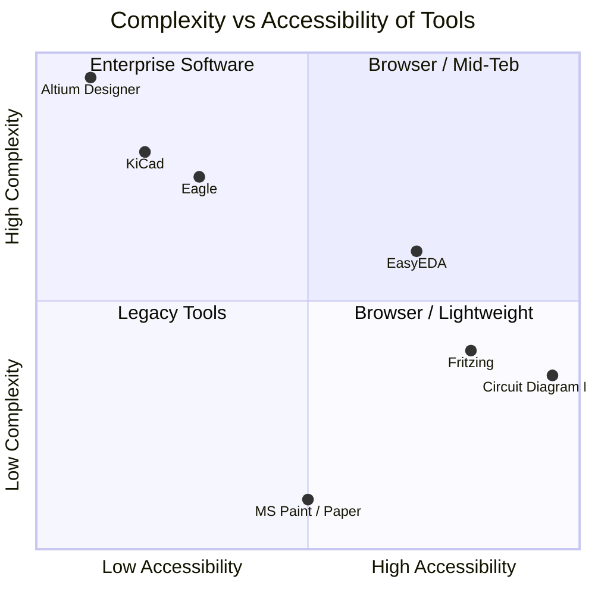
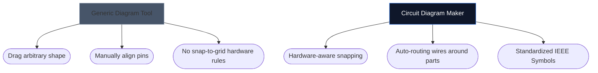

Att välja rätt verktyg för att rita dina elektronikscheman kan ofta diktera hur snabbt du kan iterera på ett nytt hårdvaruprojekt. Medan avancerade PCB-designers kräver tunga skrivbordsmiljöer, behöver hobbyister, studenter och tillverkare ofta något helt annat: tillgänglighet och hastighet.

Nedan analyserar vi hur vårt verktyg står sig mot de viktigaste branschalternativen.

## Verktygskategoriseringsmatris

Innan du dyker in i enskilda verktyg är det avgörande att förstå vilken nivå av programvara ditt projekt faktiskt kräver. Att använda programvara för företagskretskort för att skissa en 4-komponents LED-layout är överdrivet.

## 1. Kretsdiagram Maker vs. Fritzing

Fritzing är känt för att överbrygga klyftan mellan prototypframställning och scheman. Fritzing kräver dock installation och har kämpat med underhållsuppdateringar genom åren.

| Funktion | Kretsdiagram Makare | Fritzing |
| :--- | :--- | :--- |
| **Primärt fokus** | Standardschematiska layouter | Breadboard-visualiseringar |
| **Installation** | Ingen (100 % webbläsarbaserad) | Desktopinstallation krävs |
| **Kostnad** | 100 % gratis | Betald (Donationware) |
| **Inlärningskurva** | Extremt låg | Måttlig |

> **Dommen:** Om du specifikt behöver visualisera fysiktrådar som störtar in i en brödbräda, är Fritzing överlägsen. Om du behöver vanliga, universella elektroniska scheman *omedelbart*, använd Circuit Diagram Maker.

## 2. Kretsdiagram Maker vs. KiCad & Altium

KiCad är en legendarisk PCB-svit med öppen källkod, och Altium Designer är företagsindustrins standard. De är oerhört kraftfulla.

| Kapacitetslager | Kretsdiagram Makare | KiCad / Altium |
| :--- | :--- | :--- |
| **Utdatatyp** | SVG/PNG-bilder | Gerber Files, BOM, Pick&Place |
| **Simulering** | Visuell / förenklad | Deep SPICE Integration |
| **Speed ​​to First Schema** | < 10 sekunder | 10–30 minuter (Setup/Config) |

> **Dommen:** Använd KiCad eller Altium när du skickar lager av koppar till en fabrik i Shenzhen. Använd Circuit Diagram Maker när du bifogar ett schema till en fysikuppgift, ett blogginlägg eller en forumfråga.

## 3. Kretsdiagram Maker vs. draw.io / Lucidchart

Generiska diagramverktyg som draw.io är otroligt populära för flödesscheman. De saknar dock semantisk förståelse för elektronik.

När du använder ett dedikerat elektronikverktyg förstår redaktören att en tråd inte helt enkelt kan "avslutas" slumpmässigt utan en korsning, och den kartlägger i sig standardegenskaper (som Ohms till resistorer).

## Vilket verktyg är rätt för dig?

Det bästa verktyget är det som blir ur vägen. För snabba idéer, utbildningsuppgifter och webbpublikationer erbjuder [Circuit Diagram Maker](/editor/) en oslagbar kombination av snabbhet och modern estetik.