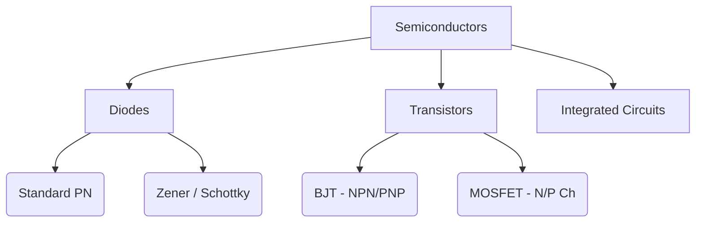

Elektroniska symboler är det universella språket för maskinvaruteknik. Precis som noter dikterar tonhöjd och rytm, förmedlar kretssymboler elektrisk funktion, egenskaper och anslutningsmöjligheter över ett papper.

I den här omfattande guiden dissekerar vi den visuella morfologin för de viktigaste elementen du kommer att stöta på i någon schematisk.

## Globala standardskillnader: IEEE vs. IEC

Innan du dyker in i specifika symboler är det viktigt att inse att symboler kan se olika ut beroende på var schemat ritades. De två dominerande standarderna är **IEEE/ANSI** (främst Amerika) och **IEC** (Europa och internationellt).

```mermaid
flowchart LR
    subgraph Regional Standards
    A((Schematic Origin))
    A -- US / Americas --> B[IEEE / ANSI]
    A -- Europe / Int'l --> C[IEC]
    end
    
    B -.-> D(Zigzag Resistors)
    C -.-> E(Rectangle Resistors)
    
    style B fill:#1e293b,stroke:#f59e0b
    style C fill:#1e293b,stroke:#3b82f6
```

I Circuit Diagram Maker använder vi i första hand IEEE/ANSI-standarden, eftersom den fortfarande är mycket populär i digitala och hobbyekosystem, även om båda är tekniskt korrekta.

## Passiva komponenter

Passiva komponenter kräver ingen extern strömkälla för att fungera och kan inte förstärka en signal.

| Komponent | Standardsymbolens utseende | Funktionsbeskrivning |
| :--- | :--- | :--- |
| **Motstånd** | Definieras av en skarp, taggig sicksacklinje. Variable varianter har en pil som genomborrar linjen. | Avleder kraft som värme för att begränsa flödet av elektrisk ström. |
| **Kondensator** | Två parallella linjer åtskilda av ett gap. Polariserade varianter kurvar en av linjerna för att indikera den negativa terminalen. | Lagrar elektrisk energi tillfälligt i ett elektriskt fält. |
| **Induktor** | En serie av rundade slingor eller halvcirklar som representerar trådspolar. | Motverkar förändringar i strömflödet genom att lagra energi i ett magnetfält. |

## Aktiva komponenter (halvledare)

Aktiva komponenter kräver en strömkälla och kan styra flödet av elektricitet, vilket ofta förstärker signaler.

| Komponent | Visuella indikatorer | Kärnanvändning |
| :--- | :--- | :--- |
| **Diod** | En triangel som pekar mot en platt linje. Linjen indikerar katoden (negativ). | En envägsventil för el. |
| **LED** | En standarddiodsymbol med två små pilar som pekar utåt, vilket betyder ljusemission. | Visuella indikatorer och optoelektronik. |
| **BJT Transistor** | En vertikal linje flankerad av tre anslutningar: bas, kollektor och en sändare med en pil som dikterar NPN eller PNP. | Strömstyrda switchar och förstärkare. |
| **MOSFET** | Har separerade gränslinjer som framhäver den isolerade grinden och interna substratdioder. | Spänningsstyrd omkoppling för hög effekt. |

## Mekaniska och utgående enheter

Dessa delar interagerar med den fysiska världen, antingen tar mänsklig input eller genererar fysisk output.

| Komponent | Schematisk stenografi | Ansökan |
| :--- | :--- | :--- |
| **Switch (SPST)** | En bruten linje som kan svänga ner för att slutföra kretsen. | Grundläggande strömkontroll PÅ/AV. |
| **Relä** | Vanligtvis avbildad som en induktor (den interna spolen) kopplad med isolerade brytarkontakter. | Växla högspänningsbelastningar via lågspänningsmikrokontroller. |
| **Motor** | En cirkel som innehåller ett 'M', ofta med angivna positiva och negativa terminaler. | Omvandling av elektrisk ström till rotationskinetik. |

> **Designtips:** Närhelst du använder mekaniska omkopplare eller reläer, inkludera alltid en *flyback-diod* över induktiva belastningar för att skydda dina halvledarkomponenter från spänningsspikar!

Att förstå dessa symboler är det första steget mot kretsflytande. Kolla in vår [onlineredigerare](/editor/) för att dra, släppa och experimentera med dessa former direkt.