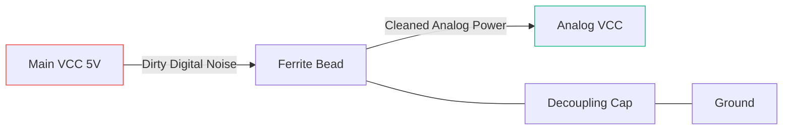

Höghastighets digital elektronik skapar mycket elektromagnetiskt brus. Utan dämpning blöder denna högfrekventa störning in i känsliga analoga ledningar eller strålar utåt, vilket gör att din enhet misslyckas spektakulärt med FCC-emissionstestning.

Det primära vapnet mot denna störning är **ferritpärlan**. Att förstå dess schematiska symbol och placering avgör om din krets fungerar rent eller drunknar i sitt eget brus.

## 1. Visualisera ferritpärlsymbolen

En ferritpärla fungerar i sig som en induktor med kraftigt förluster. På grund av detta är dess schematiska symbol nära besläktad med standardinduktorsymbolen, men skräddarsydd för att betona dess specifika roll.

```mermaid
graph LR
    A[Inductor Basis] --> B(Standard Inductor Symbol)
    A --> C(Rectangle Over Wire)
    B -.-> D(Addition of a dashed line or solid bar)
    D --> E[IEEE Ferrite Symbol]
    C --> F[IEC Ferrite Symbol]
    
    style E fill:#0f172a,stroke:#3b82f6
    style F fill:#0f172a,stroke:#10b981
```

| Egenskap | IEEE/ANSI Standard | IEC-standard | Anteckningar |
| :--- | :--- | :--- | :--- |
| **Form** | Serie av halvcirklar med en bar/låda | Ett massivt rektangulärt block | Funktionellt identisk i utfall |
| **Beteckningsprefix** | `FB` | "FB" eller "L" | Att använda "FB" rekommenderas starkt för att förhindra förväxling med induktorer |
| **Mätenhet** | Ohm (Ω) vid specifik MHz | Ohm (Ω) vid specifik MHz | Till skillnad från induktorer mätt i Henries (H) |

> **Avgörande skillnad:** Betygsätt aldrig en ferritpärla efter induktans. Ferritpärlor specificeras av deras **impedans (i ohm) vid en specifik frekvens** (vanligtvis 100 MHz).

## 2. Kärndriftsmekanik

Varför använda en ferritpärla istället för en vanlig induktor?

* En **induktor** lagrar energi och återför den till kretsen. Det är mycket reaktivt och bevarar energi.
* En **ferritpärla** är aktivt designad för att vara *förlustig*. Vid höga frekvenser beter den sig som ett motstånd och omvandlar oönskat högfrekvent brus direkt till värme.

| Frekvensområde | Beteende på ferritpärlor | Resultat på Circuit |
| :--- | :--- | :--- |
| **Låg frekvens / DC** | Under 1 MHz | Fungerar som en enkel tråd (~0 Ω). Likström passerar fritt. |
| **Resonansfrekvens** | Mycket reaktivt | Lagrar energi kort. |
| **Hög frekvens** | Över 50 MHz+ | Fungerar som ett högvärdigt motstånd. Blockerar och avleder RF-brus som värme. |

## 3. Bästa metoder för schematisk placering

Att använda FB-symbolen på rätt sätt kräver strategisk placering. Att slumpmässigt slå ferritpärlor på ett schema kan faktiskt förvärra ringsignaler och resonans.

### Frånkoppling av nätaggregat (Pi-filter)

Den absolut vanligaste användningen av en "FB"-symbol är att isolera smutsig digital ström från ren analog ström.

I konfigurationen ovan (en del av ett Pi-filter) blockerar ferritpärlan högfrekventa transienter från att komma in i AVCC-linjen, medan kondensatorn shuntar eventuell kvarvarande rippel ner till jord.

### EMI-undertryckning av datalinje

När du drar långa USB-datakablar eller HDMI-spår placeras "FB"-symboler ofta i serie nära kontakten. Detta säkerställer att den långa, fysiskt exponerade kabeln inte fungerar som en antenn och utstrålar CPU-ljud över rummet.

För att lägga till en ferritpärla till ditt nästa schema, öppna **[Circuit Diagram Editor](/editor/)**, sök efter "Ferrite" och ange din impedansklassificering!