Att bygga en strömriktare – att konvertera ett 12V bilbatteri till 220V växelström som kan driva hushållsapparater – är en övergångsrit för elektronikingenjörer.

Innan du lyfter en lödkolv måste du uppnå en felfri förståelse av det underliggande schemat. Högspänningskretsar är oförlåtande, och ett dåligt ritat diagram garanterar brända MOSFET-enheter eller allvarlig elektrisk stöt. Denna guide bryter ner arkitekturen hos en grundläggande fyrkantsvågsomriktare.

> **Säkerhetsvarning:** 220V AC-ström är livsfarligt. Den här artikeln är en utforskning av schematisk logik och teoretisk design, inte en tillverkningsritning. Bygg aldrig högspänningskretsar utan avancerad elektrisk utbildning.

## Arkitekturen med tre pelare

Oavsett hur komplex en modern växelriktare är, kan schemat alltid visuellt och logiskt delas in i tre distinkta funktionsblock.

```mermaid
flowchart LR
    DC_SRC[(12V DC Battery)] --> OSC[1. Oscillator Block]
    OSC -- Low Power Square Wave --> AMP[2. Power Switch Block]
    AMP -- High Current 12V Wave --> TX[3. Step-Up Transformer]
    TX -- Magnetic Induction --> AC_OUT((220V AC Output))
    
    style OSC fill:#0f172a,stroke:#3b82f6
    style AMP fill:#0f172a,stroke:#f59e0b
    style TX fill:#0f172a,stroke:#ef4444
```

### Steg 1: The Oscillator (The Brains)

Likström (DC) från ett batteri flyter i en rak linje. Transformatorer kan inte öka en rak linje; de kräver fluktuerande magnetfält. Därför måste vi omvandla DC till en artificiell AC-våg (vanligtvis 50Hz eller 60Hz beroende på geografisk region).

| Komponent som används | Schematisk roll | Varför det är valt |
| :--- | :--- | :--- |
| **CD4047 IC / 555 Timer** | Astabil multivibrator | Matar ut en anmärkningsvärt stabil fyrkantvåg genom att beräkna en RC-tidskonstant. |
| **Nätverk för motstånd och kondensator** | Tidskalibratorer | Värden (t.ex. `R=100kΩ`, `C=0.1μF`) dikterar unikt den exakta 50Hz-frekvensen. |

### Steg 2: Strömbrytarna (muskeln)

Det logiska chippet producerar en orörd 50Hz-våg, men vid exceptionellt låga strömgränser (ofta under 20mA). Om du matade in det i en transformator, skulle det inte generera tillräckligt med magnetiskt flöde för att driva en glödlampa.

Vi placerar högeffekttransistorer mellan oscillatorn och transformatorspolarna.

1. Oscillatorns svaga signal träffar **Gaten** på en massiv N-Channel MOSFET (som IRF3205).
2. MOSFET fungerar som ett elektroniskt kraftigt relä.
3. Den växlar rasande den enorma strömstyrkan från 12V-batteriet direkt genom transformatorns spolar 50 gånger i sekunden.

### Steg 3: The Step-Up Transformer

Vid denna punkt i schemat har vi enorma mängder 12V-ström som pulserar fram och tillbaka. Det sista steget kräver dirigering av detta genom primärspolarna i en transformator.

| Funktion | Schematiska detaljer | Verkliga implikationer |
| :--- | :--- | :--- |
| **Primärspole (vänster)** | Centrerad konfiguration (`12V - 0 - 12V`) | Tillåter fram och tillbaka push-pull-växling från två alternerande MOSFET:er. |
| **Kärnlinjer** | Två heldragna linjer ritade vertikalt | Represents the iron/ferrite core necessary for high-efficiency magnetic induction. |
| **Sekundär spole (höger)** | Massivt ökat lindningsförhållande | Fysiken stegar upp det pulserande 12V magnetiska flödet till en dödlig, flyktig 220V-våg. |

## Ritningsöverväganden

När du använder **[Circuit Diagram Editor](/editor/)** för att utforma denna design, kom ihåg bästa praxis för layout:

* Rita de tunga linjerna som bär 12V-batteriströmmen tjockare än oscillatorlinjerna med låg effekt.
* Jorda MOSFET-källans stift explicit och unikt; flytta dem inte tillbaka nära den känsliga oscillatorjorden för att förhindra bruskoppling.
* Avgränsa 220V-utgångarna grafiskt! Placera varningsetiketter och utgångsportar (som en uttagssymbol) istället för att lämna nakna ledningar som slutar i tomrummet.