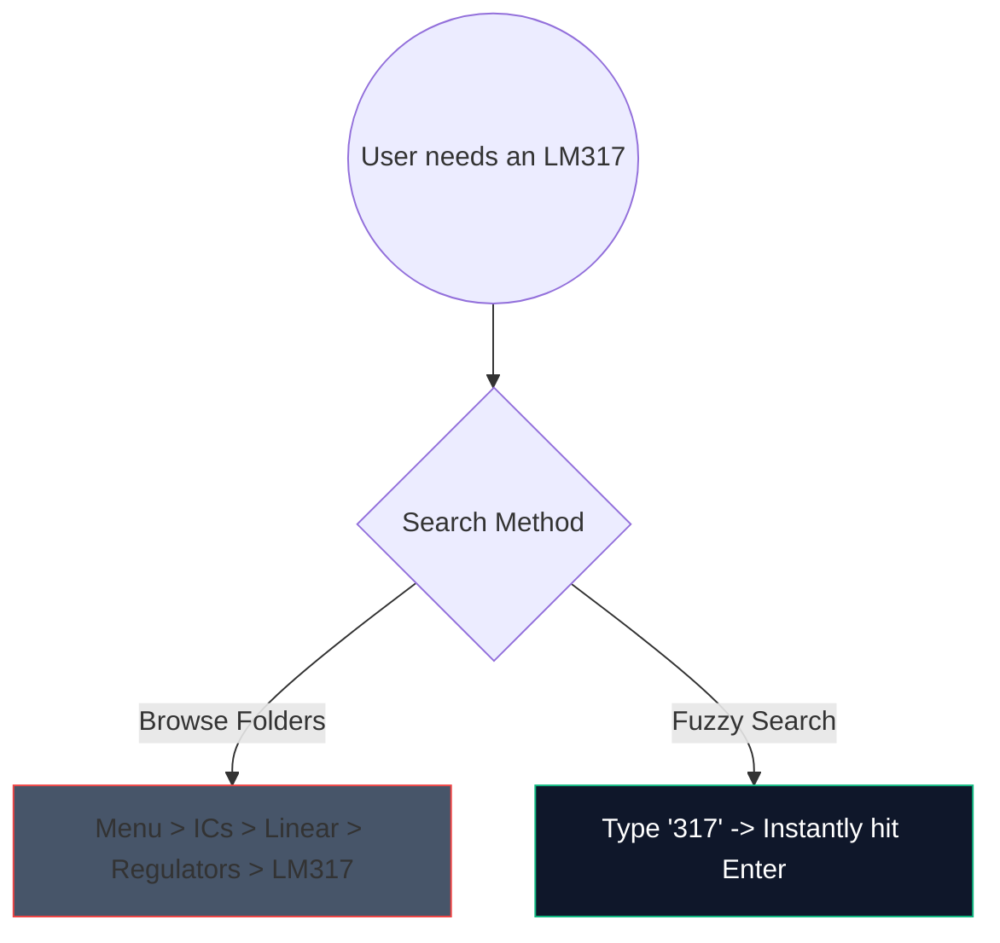

Dagarna med att ladda ner tung 2-gigabyte datorprogramvara bara för att skissa på en enkel förstärkarkrets är över. Webbläsarbaserad CAD (Computer-Aided Design) är här, och det är fenomenalt snabbt.

Här är exakt hur du kan använda moderna webbverktyg för att generera scheman av produktionskvalitet på under 5 minuter.

## Varför webbläsarbaserad kretsdesign?

Om du är utbildare, student eller hobbyist som skriver dokumentation, övertrumfar hastighet och tillgänglighet råa funktioner.

```mermaid
flowchart LR
    subgraph Traditional Workflow
    DL[Download/Install] --> CONF[Configure Libraries] --> DRAW1[Draw]
    end
    
    subgraph Web Workflow
    URL[Go to URL] --> DRAW2[Draw immediately]
    end
    
    style URL fill:#0f172a,stroke:#3b82f6
    style DRAW2 fill:#1e293b,stroke:#10b981
```

| Metrisk | Desktopapplikation | Kretsdiagram Makare |
| :--- | :--- | :--- |
| **Förvaringsutrymme** | 1GB - 5GB+ | 0 MB (molnbaserat) |
| **OS-kompatibilitet** | Ofta endast Windows-portar eller buggyportar | Universellt webbkompatibel |
| **Starttid** | 15–30 sekunder | < 1 sekund |
| **Bärbarhet** | Begränsad till en maskin | Tillgänglig överallt |

## Core Workflow Hacks for Speed

När du använder en webbredigerare förvandlar användningen av kortkommandon upplevelsen från att "klicka runt" till ett oavbrutet flödestillstånd.

Här är genvägarna med högsta ROI att memorera i vår editor:

| Åtgärd | Snabbkommando | Arbetsflödesfördel |
| :--- | :--- | :--- |
| **Wire Routing** | `W` | Växlar omedelbart markören till anslutningsläge, vilket möjliggör snabb nätrouting utan att flytta till ett verktygsfält. |
| **Komponentrotation** | "R" (medan du håller i delen) | Att orientera resistorer eller transistorer innan de placeras sparar enorma mängder rengöringstid senare. |
| **Duplicate Selection** | `Ctrl + D` eller `Alt-Dra` | Dra inte ut 8 lysdioder från menyn; placera en, konfigurera den och duplicera den 7 gånger direkt. |
| **Pan Canvas** | `Mellanslag + Dra` | Håller din zoomnivå konsekvent samtidigt som du navigerar i massiva, komplexa layouter. |

## Använda komponentsökningen

Att söka visuellt genom massiva rullgardinsmenyer är tråkigt. Vi integrerade en robust fuzzy-sökmekanism.

Klicka bara på sökfältet och skriv "NPN" istället för att klicka på "Halvledare -> Transistorer -> BJT". Verktyget kurerar omedelbart den högsta sannolikhetsmatchningen.

## Exporterar för professionellt bruk

Att skapa diagrammet är bara halva striden; att injicera det i din avhandling eller tekniska blogg är den andra hälften.

Exportera alltid dina kretsmönster som **SVG (Scalable Vector Graphics)** när det är möjligt, snarare än PNG eller JPG. En SVG lagrar matematiskt definierade linjer snarare än pixlar, vilket innebär att du kan skala upp ditt schema till anslagstavlans storlek och det kommer ständigt att förbli nålskarpt utan rastreringsoskärpa.

Är du redo att testa din hastighet? **[Starta appen](/editor/)** och försök skapa en 555-timers blinkande LED-krets!