Att öppna ett komplext schema för första gången känns som att stirra på ett främmande språk. Dussintals korsande linjer, kryptiska förkortningar och taggiga symboler smälter samman i en vägg av visuellt brus.

Erfarna ingenjörer läser dock inte scheman genom att stirra på hela sidan. De isolerar, spårar och erövrar. Här är steg-för-steg-metoden för att dechiffrera vilket kretsschema som helst.

## Steg 1: Isolera kärnkraftsinfrastrukturen

Innan du förstår vad en krets *gör*, måste du förstå *hur den andas*.

Varje schema har ingångspunkter för elektrisk energi. Din första uppgift är att lokalisera alla större spänningsskenor och jordreferenser.

```mermaid
flowchart TD
    A[Start: Scan Edges] --> B{Look for Power Symbols}
    B -- Found Battery/Jack --> C[Trace the initial VCC and GND lines]
    B -- Found Net Labels --> D[Locate generic +5V, +3.3V pads]
    C --> E[Are there Voltage Regulators?]
    D --> E
    E -- Yes --> F[Mentally divide circuit into Voltage Zones]
    E -- No --> G[Circuit runs on single voltage]
    
    style A fill:#0f172a,stroke:#3b82f6
    style F fill:#1e293b,stroke:#f59e0b
```



| Symbol/Text | Betydelse | Åtgärdskrav |
| :--- | :--- | :--- |
| `VCC` / `VDD` | Positiv matningsspänning för IC. | Spåra detta för att säkerställa att varje IC får ström. |
| `GND` / `VSS` | Den gemensamma referensen. | Antag att alla dessa symboler fysiskt ansluter samman. |
| `LDO` / `buck` | Ett chip som reglerar spänningen ner. | Notera vilka komponenter som är nedströms med den nya lägre spänningen. |

## Steg 2: Avmystifiera "hjärnorna" (IC)

När du vet var kraften flödar, leta efter de största rektanglarna på sidan. Integrerade kretsar (ICs) dikterar schemats primära funktion.

Om du stöter på en IC märkt "U1" med ett kryptiskt artikelnummer som "NE555" eller "ATmega328P", sluta läsa schemat omedelbart. Öppna en ny flik och dra **databladet**.

Du behöver inte förstå den interna halvledarfysiken; titta helt enkelt på databladets "Pinout Diagram". Om stift 4 är "RESET" och stift 8 är "VCC", mappa omedelbart den logiken tillbaka till ritningen.

## Steg 3: Spåra ingångar och utgångar

Kretsar är funktionella maskiner. De tar emot miljöinput, bearbetar den och producerar ett resultat.

```mermaid
quadrantChart
    title Input/Output Hardware Identification
    x-axis Analog/Physical --> Digital/Data
    y-axis Input Devices --> Output Devices
    quadrant-1 Digital Receivers (e.g. WiFi)
    quadrant-2 Digital Displays (e.g. OLEDs)
    quadrant-3 Physical Actuators (e.g. Motors)
    quadrant-4 Physical Sensors (e.g. Thermistors)
    "Push Button": [0.1, 0.4]
    "Photoresistor": [0.2, 0.2]
    "UART RX": [0.8, 0.4]
    "UART TX": [0.8, 0.6]
    "Speaker": [0.3, 0.8]
    "LED": [0.4, 0.7]
```

Spåra ledningar utåt från de centrala IC:erna. Om ett IC-stift ansluts till en lysdiod är det en visuell utgång. Om ett stift ansluts till en SPST-switch som går till jord, är det en mänsklig ingång.

## Steg 4: Validera korsningar och korsningar

Det vanligaste läsfelet för nybörjare innebär missförstånd av ledningar som korsar varandra.

* **En prick ger en knut:** Om två korsande linjer har en hel prick vid korsningen, är de fysiskt lödda/sammanbundna. Ström kan flyta mellan dem.
* **Ingen prick ger en bro:** Om två linjer bildar ett vanligt kors (+), berör de *inte*. De är besläktade med två motorvägar som passerar över varandra på en överfart.

## Steg 5: Identifiera underkretsar (det hemliga vapnet)

Ingenjörer designar sällan kretsar helt från grunden. De limmar ihop standardmodulära underkretsar. När du har lärt dig att känna igen dessa visuella "ord", slutar du läsa enskilda "bokstäver".

| Visuellt mönster | Standard underkrets | Funktion |
| :--- | :--- | :--- |
| Kondensator som går från "VCC" till "GND" precis bredvid en IC. | **Frånkopplingskondensator** | Absorberar buller. Ignorera det när du analyserar logiskt flöde. |
| Motstånd från ett digitalt stift omslag upp till `+5V`. | **Uppdragsmotstånd** | Förhindrar flytande stift; säkerställer ett stabilt HÖG standardtillstånd. |
| Två motstånd placerade i serie mellan spänning och jord, uttagna i mitten. | **Spänningsdelare** | Sänker en spänning proportionellt för att säkert avläsas av ett sensorstift. |

Omsätt denna teori i praktiken. Öppna **[Circuit Diagram Editor](/editor/)**, ladda en mall och kartlägg kraften, hjärnan, ingångarna och utgångarna för dig själv!