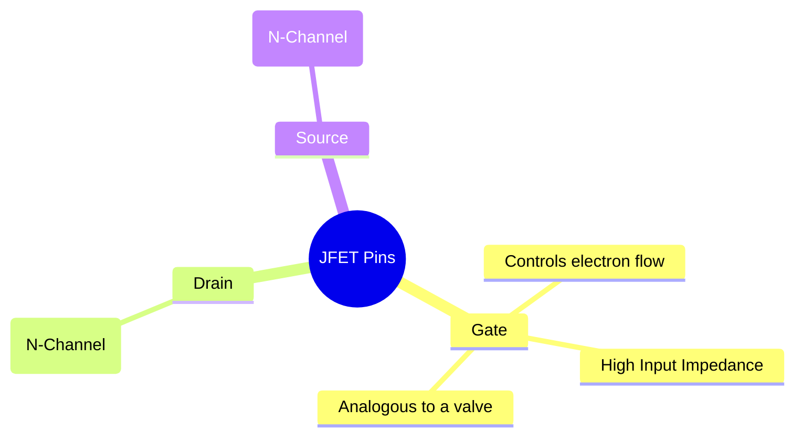

Innan den massiva spridningen av MOSFET:er var **JFET** (Junction Field-Effect Transistor) kungen av hög ingångsimpedansförstärkning. Även om de inte används lika ofta i modern digital logik, förblir de oumbärliga artefakter i högfientliga ljudförförstärkare, känslig instrumentering och RF-kretsar.

Att förstå den schematiska JFET-symbolen är viktigt för alla som fördjupar sig i diskret analog kretsdesign.

## 1. JFET-symbolens anatomi

Till skillnad från bipolära kopplingstransistorer (BJT) som är strömstyrda enheter, är en JFET en **spänningsstyrd** enhet. Den schematiska symbolen försöker visuellt representera den fysiska konstruktionen av dess interna halvledarkanal.

Symbolen består av en rak vertikal linje som representerar kanalen, med två horisontella linjer som hakar fast i den (Drain och Source). En tredje vinkelrät linje bildar porten, komplett med en pil som dikterar halvledarpolariteten.

### N-Channel vs. P-Channel JFET

Precis som BJTs har NPN och PNP, kommer JFETs i två distinkta smaker.

| Karakteristisk | N-Channel JFET | P-Channel JFET |
| :--- | :--- | :--- |
| **Symbolpil** | Pekar **IN** mot kanallinjen | Poäng **UT** från kanalen |
| **Majoritetsföretag** | Elektroner | Hål |
| **Vgs för Pinch-Off** | Negativ spänning (t.ex. -5V) | Positiv spänning (t.ex. +5V) |
| **Typisk drift**| Normalt PÅ -> Applicera negativ spänningsmatris för att stänga AV | Normalt PÅ -> Applicera positiv spänningsmatris för att stänga AV |

> **Minnestrick:** "Peka IN" betyder **N**-kanal. Titta på pilen på porten. Om den pekar inåt mot linjen har du att göra med en N-Channel JFET (som den populära 2N5457).

## 2. Funktion: Utarmningsläget

En av de mest definierande egenskaperna hos en JFET är att det är en **Depletion Mode**-enhet. Detta påverkar i hög grad hur du utformar scheman runt dem.

* **MOSFET (förbättringsläge):** är normalt AV. Du måste lägga en spänning på grinden för att slå PÅ dem.
* **JFET (utarmningsläge):** är normalt PÅ. Med 0 volt vid grinden flyter maximal ström från Drain till Source. Du måste applicera en *omvänd bias*-spänning (negativ för N-kanal) för att expandera utarmningsområdet och bokstavligen "nypa av" flödet av elektroner, vilket stänger av enheten.

```mermaid
flowchart LR
    VGS[V_GS = 0V] --> I1[Maximum Drain Current flows]
    VGS2[V_GS = -2V] --> I2[Current is restricted]
    VGS3[V_GS = -5V] --> I3[Pinch-Off reached. Circuit is OFF]
    
    style VGS fill:#1e293b,stroke:#f59e0b
    style VGS3 fill:#1e293b,stroke:#ef4444
```

## 3. Typiska schematiska applikationer

Eftersom porten för en JFET är omvänd förspänd under drift, flyter i huvudsak noll ström in i den. Detta ger en astronomiskt hög ingångsimpedans (mätt ofta i hundratals Megaohm).

| Kretstillämpning | Varför JFET väljs | Schematiska ledtrådar |
| :--- | :--- | :--- |
| **Ljudförförstärkare** | Extremt lågt brus och massiv ingångsimpedans förhindrar laddning av känsliga elgitarrpickuper. | Ses ofta agera som ett buffertsteg för källföljare. |
| **Analoga omkopplare** | Eftersom de är rent spänningsstyrda utan grindström, injicerar de noll omkopplingstransienter i signalvägen. | Placeras i serie med en analog signal som passerar genom avloppskällan. |
| **Konstantströmkällor** | En JFET beter sig naturligt som en konstant strömsänka när grinden är bunden direkt till källan. | Gateterminal kopplad direkt runt till Source-terminalen. |

När man ritar dessa specialiserade analoga kretsar är precision nyckeln. Se till att portpilen är korrekt orienterad för att förhindra tillverkningsfel. Använd det kurerade diskreta halvledarbiblioteket i **[Circuit Diagram Maker](/editor/)** för att placera standard N-Channel och P-Channel JFET-symboler exakt på din nästa arbetsyta.