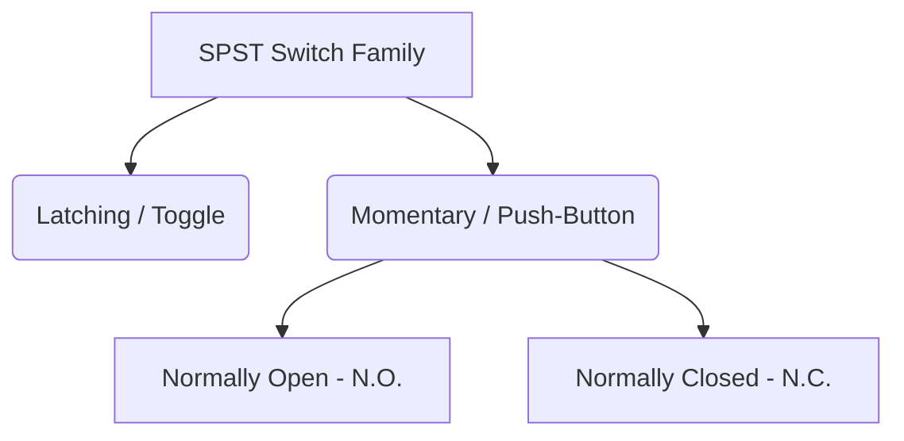

I hjärtat av varje gränssnitt som människor använder för att styra elektricitet ligger den mekaniska omkopplaren. Den enklaste, mest allmänt förekommande inkarnationen av denna komponent är **SPST**, eller Single Pole Single Throw switch.

Oavsett om du designar en högspänningsströmbrytare eller helt enkelt kartlägger en tryckknapp på en Arduino breadboard, är SPST-symbolen din logiska utgångspunkt.

## 1. Vad SPST egentligen betyder

Ingenjörer klassificerar switchar med hjälp av två variabler: **Poler** och **Kast**.

* **Pol (P):** Antalet oberoende elektriska kretsar som switchen kan styra samtidigt. 
* **Kast (T):** Antalet stängda tillstånd (ON-lägen) varje stolpe har.

Därför är en SPST en *Single Pole* (kontrollerar en krets) och *Single Throw* (har bara en stängd, ledande position).

```mermaid
flowchart LR
    A[Human Input] --> B((SPST Mechanism))
    B -- Open / Default --> C[Infinite Resistance / OFF]
    B -- Closed / Actuated --> D[Zero Resistance / ON]
    
    style B fill:#0f172a,stroke:#f59e0b
```

## 2. Läser SPST Schematisk symbol

Standard IEEE-symbolen för en SPST-switch är mycket intuitiv – den ser bokstavligen ut som den gör.

| Visuellt element | Mening i den verkliga världen |
| :--- | :--- |
| **Två öppna cirklar** | De stationära elektriska kontaktplattorna där ledningar slutar. |
| **Diagonal bruten linje** | Den mekaniskt ledande armen, fysiskt skild från den andra plattan för att indikera ett "Öppet" standardläge. |
| **Beteckning (`S` eller `SW`)** | Standard referenstaggar. t.ex. "SW1". |

> **Antagande om normalt tillstånd:** Om inget annat anges dras mekaniska brytare i sitt **oaktiverade viloläge**. För en standard SPST-ljusomkopplare betyder detta att schemat visar den som AV.

## 3. Variationer av SPST: Tryckknappar

En vippströmbrytare stannar där du sätter den (låsande). En tryckknapp aktiveras endast när fingret är på den (momentärt). SPST-beteckningen gäller båda, men symbolerna ändras något för att särskilja mänskliga interaktionslägen.

| Switch Typ | Schematisk ändring | Exempel från verkliga världen |
| :--- | :--- | :--- |
| **Push-Button (N.O.)** | Istället för en vinklad arm svävar en platt bro *ovanför* de två kontaktdynorna. Att trycka ner överbryggar gapet. | Tangentbordstangenter, datorströmknappar, dörrklockans knappar. |
| **Push-Button (N.C.)** | Den platta bron vilar *under* eller rör vid dynorna, vilket håller kretsen PÅ som standard. Att trycka ner bryter anslutningarna. | Nödstoppsknappar (Nödstopp) på tunga maskiner. |

## 4. Varningar för maskinvaruimplementering

När man införlivar en SPST-switch i en digital logikkrets (som ett Raspberry Pi GPIO-stift), kommer en naiv schematisk design att leda till katastrofalt oförutsägbart programvarubeteende.

### Problemet med "flytande stift".

Om du ansluter ena sidan av en SPST-switch till 5V och den andra sidan rakt till ett mikrokontrollerstift, vad händer när omkopplaren är öppen? Stiftet visar inte 0V – det är frånkopplat och "svävar", fungerar som en antenn som plockar upp omgivande elektromagnetism.

**The Fix: Pull-Down Resistors**

Inkludera alltid ett motstånd (vanligtvis 10kΩ) anslutet mellan det digitala stiftet och jord.

1. **Stäng AV:** Stiftet läser 0V säkert genom motståndet.
2. **Slå PÅ:** 5V-matningen övermannar motståndet och utlöser ett säkert HÖG-tillstånd.

Inkorporera SPST-variationer i dina mönster på ett säkert sätt via **[Circuit Diagram Editor](/editor/)**. Expandera det vänstra "Switches"-biblioteket för att hitta N.O. och N.C. implementeringar!