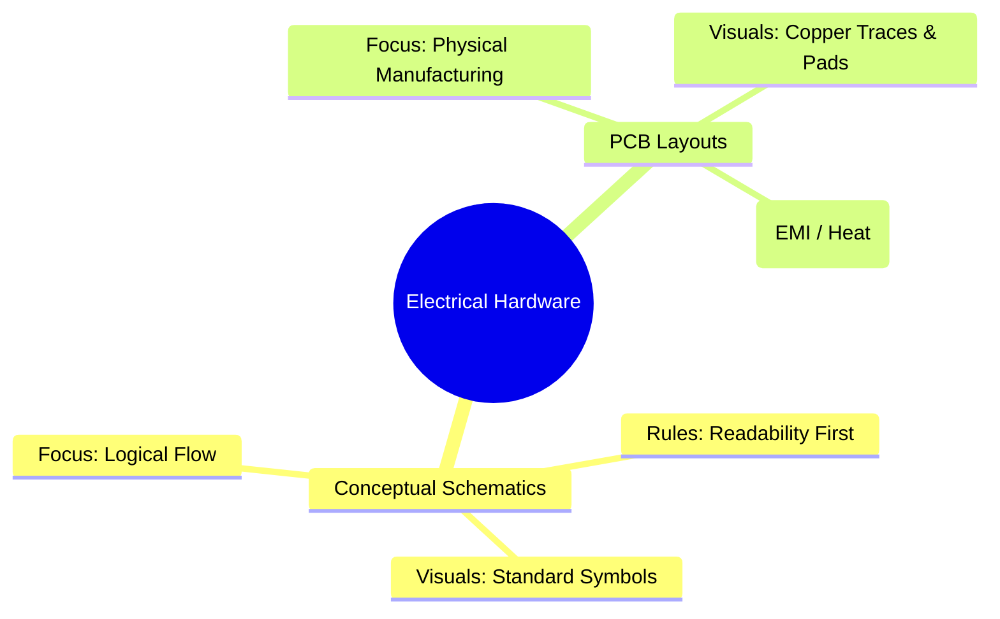
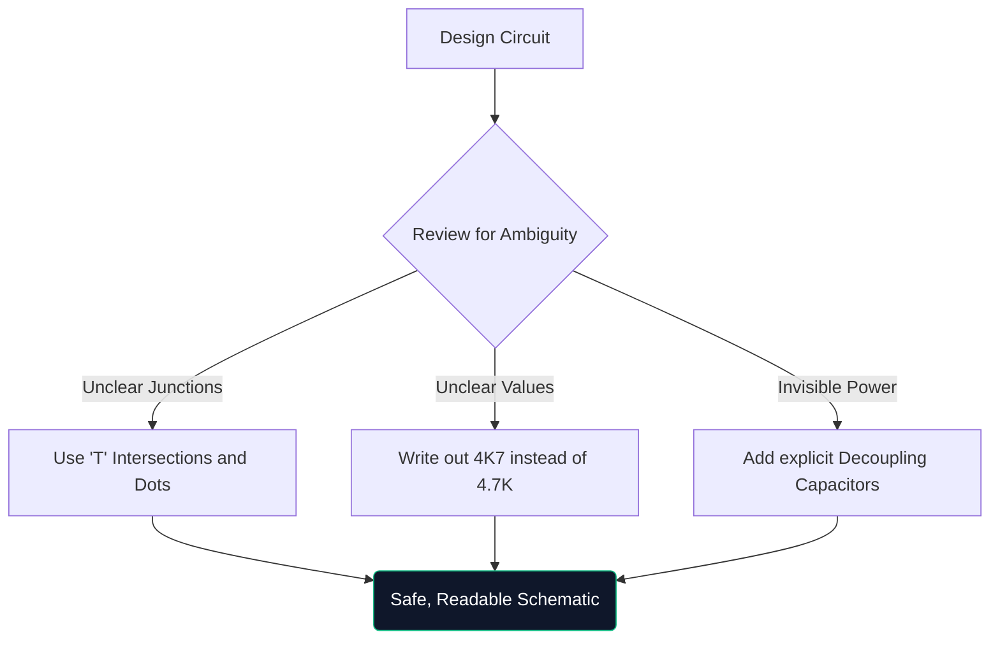

Välkommen till den definitiva mästarklassen om kretsscheman. Oavsett om du hackar ihop Arduino-prototyper på en helg eller studerar elektroteknik, är förståelsen av schematisk arkitektur inte förhandlingsbar.

Den här guiden går bortom grunderna och utvärderar hur moderna diagram är konstruerade, verifierade och tillverkade.

## Teoretiska scheman vs. PCB-layouter

En mycket vanlig förvirringspunkt är skillnaden mellan ett schematiskt diagram och en kretskortslayout (PCB). De är helt olika representationer av samma elektriska sanning.

| Egenskap | Schematiskt diagram | PCB-layout |
| :--- | :--- | :--- |
| **Syfte** | För att förstå *hur* kretsen fungerar logiskt | Att diktera *vart* kopparn går fysiskt |
| **Komponentrepresentation** | Abstrakta symboler (trianglar, sicksack) | Fysiska 1:1 fotavtrycksdynor (t.ex. SOIC-8, 0805) |
| **Anslutningar** | Perfekta geometriska linjer | 45-graders vinkel kopparspår |
| **Miljö** | Rent, vitt bakgrundspapper | Flerskiktigt bokstavligt 3D-utrymme |

## Anatomy of a Advanced Schematic

När kretsar växer över 100 komponenter förändras visuella paradigm. Du kan inte bara koppla ihop allt med dragna ledningar.

1. **Titelblock**: Professionella scheman har alltid ett block i det nedre högra hörnet som anger Företagsnamn, Ingenjör of Record, Revisionsnummer och Datum.
2. **Netetiketter och portar**: Ledningar ansluter inte undersystem; namngivna etiketter gör. Om två ledningar är märkta "CLK_OUT", är de elektriskt anslutna, även om de finns på olika sidor.
3. **Hierarkiska block**: Massiva konstruktioner (som ett datormoderkort) använder hierarki. Ett enda rektangulärt block märkt "Memory Interface" innehåller en helt separat schematisk sida inuti den.

## Regeln för "Defensiv ritning"

I likhet med defensiv körning innebär defensiv ritning att den person som läser ditt schema kommer att missförstå det om du inte uttryckligen vägleder dem.

> **Varför skriva `4K7`?** I tryckta eller fotokopierade scheman försvinner en liten decimalkomma (`.`) lätt på grund av artefakter. Att skriva `4.7K` riskerar att någon läser det som `47K`, vilket kan steka en komponent. Att skriva "4K7" gör att multiplikatorn fungerar som decimalkomma, vilket praktiskt taget eliminerar felläsningar.

## Övergång till digitala CAD-verktyg

Att rita på millimeterpapper är utmärkt för brainstorming, men praktiskt taget värdelöst för produktion. När du migrerar dina designs till ett verktyg som [Circuit Diagram Maker](/editor/), får du flera superkrafter:

* **Netlists**: Digitala verktyg matematiskt bevisar samband.
* **Återanvändbarhet**: Att kopiera och klistra in komplexa reglerade nätaggregat från tidigare projekt sparar timmar.
* **Vektorkvalitet**: Export som SVG garanterar perfekt skarpa linjer oavsett hur mycket du zoomar in.

Språnget från teori till verklighet börjar med en väldragen linje. Börja din resa idag!