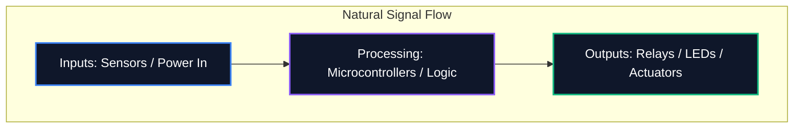

İster bir forumda bir diyagram paylaşıyor olun ister profesyonel PCB üretimi için gönderiyor olun, şemanızın okunabilirliği mantıksal doğruluğu kadar önemlidir. Dağınık bir şema, yönlendirme hatalarına, bileşenlerin yanlış anlaşılmasına ve zaman kaybına neden olur.

Bu kılavuz, profesyonel elektronik mühendisleri tarafından temiz, bakımı yapılabilir ve yüksek düzeyde okunabilir devre şemaları oluşturmak için kullanılan temel en iyi uygulamaları özetlemektedir.

## 1. Şemanın Akışı: Soldan Sağa, Yukarıdan Alta

Şematik teknik bir belgedir ve her belge gibi doğal olarak okunması gerekir. Elektronik tasarımında standart gelenek, girişlerin soldan akmasını ve çıkışların sağdan çıkmasını gerektirir.

Benzer şekilde, daha yüksek voltajlar açıkça şemanın üstüne, daha düşük voltajlar veya toprak ise alta yerleştirilmelidir.



## 2. Güç ve Toprak Sembolleri

Hiçbir zaman her bir topraklama pimini birbirine bağlayan uzun, sarmal kablolar çekmeyin. Okunması imkansız bir örümcek ağı oluşturur. Bunun yerine bileşende yerel güç ve toprak sembollerini kullanın.

| Kötü Uygulama | En İyi Uygulama | Neden Önemlidir |
| :--- | :--- | :--- |
| Tüm zeminleri tek bir sürekli kabloyla bağlama | Her bileşende yerel "GND" sembollerinin kullanılması | Görsel dağınıklığı azaltır; dönüş yollarını karmaşık izleme olmadan açıkça tanımlar |
| Sinyal izlerinin üzerinden geçen VCC hatlarının yerleştirilmesi | Yukarıyı gösteren yerel "VCC" / "+5V" sembollerini kullanma | Sinyal hatlarının görsel olarak güç dağıtımıyla karıştırılmasını önler |
| Farklı zeminlerin aynı sembolle etiketlenmesi | Analog Toprak (AGND) ve Dijital Toprak (DGND)'nin Ayırt Edilmesi | Karışık sinyal tasarımlarında toprak döngülerinden ve gürültü yayılımından kaçınmak için kritik öneme sahiptir |

## 3. Kavşak Noktaları ve Geçişler

Şematik tasarımdaki en tehlikeli hatalardan biri tellerin kesiştiği yerdeki belirsizliktir.

```mermaid
graph TD
    A[Is it a connection?]
    A --> B{Is there a junction dot?}
    B -- Yes --> C[Wires are electrically connected (Node)]
    B -- No --> D[Wires are crossing without connecting]
    
    style A fill:#1e293b,stroke:#f59e0b
    style C fill:#1e293b,stroke:#10b981
    style D fill:#1e293b,stroke:#ef4444
```

> **Profesyonel İpucu:** Asla "4 yollu" kavşakları ('+' şeklinde bir haç) kullanmayın. Dört kablonun buluşması gerekiyorsa, bunları iki adet 3 yollu 'T' bağlantı noktasına yerleştirin. Bu, belirsizliği tamamen ortadan kaldırır; Yazdırma veya ölçekleme sırasında bağlantı noktası kaybolursa, 'T' şekli hala açık bir şekilde bir bağlantıyı ima eder, ancak çıplak bir çarpı işareti göstermez.

## 4. Mantıksal Bileşen Gruplaması

64+ pinli mikrodenetleyiciler içeren büyük şemalarla uğraşırken, her kabloyu fiziksel olarak bileşene çekmeye çalışmak boşuna bir egzersizdir. Bunun yerine profesyonel araçlar **Net Etiketleri** kullanır.

Devrenizin işlevsel bloklarını görsel bölgelere gruplayın. Örneğin, güç kaynağını bir köşeye, MCU'yu ortaya ve motor sürücülerini başka bir köşeye yerleştirin. Bunları yalnızca açıklayıcı Ağ Etiketleri (örneğin, "SPI_MOSI", "UART_TX", "MOTOR_PWM") kullanarak bağlayın.

## 5. Referans Belirteçleri ve Değerler

Çıplak bir direnç sembolü izleyiciye hiçbir şey söylemez. Her bileşenin benzersiz bir referans göstergesi ve açık bir değeri olmalıdır.

| Bileşen Kategorisi | Standart Önek | Örnek |
| :--- | :--- | :--- |
| **Dirençler** | 'R' | 'R1 (10kΩ)' |
| **Kapasitörler** | 'Ç' | 'C4 (100nF)' |
| **Entegre Devreler** | 'U' veya 'IC' | 'U2 (LM358)' |
| **Diyotlar / LED'ler** | 'D' | 'D1 (1N4148)' |
| **Transistörler / MOSFET'ler** | 'S' | 'Ç1 (2N2222)' |
| **İndüktörler** | 'L' | 'L1 (4.7μH)' |
| **Konektörler/Başlıklar** | 'J' veya 'P' | 'J1 (Güç Girişi)' |

Bu kurallara bağlı kalmak, şemanızın dünyanın herhangi bir yerindeki herhangi bir mühendis tarafından anında anlaşılmasını garanti eder. Bu kuralları bugün [Devre Şeması Düzenleyicisi](/editor/)'de uygulamaya başlayın.