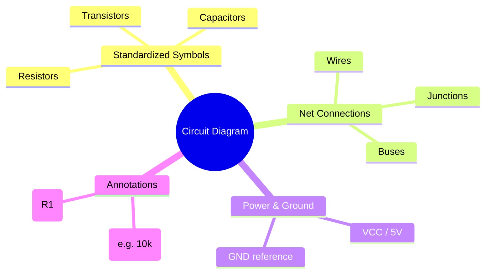
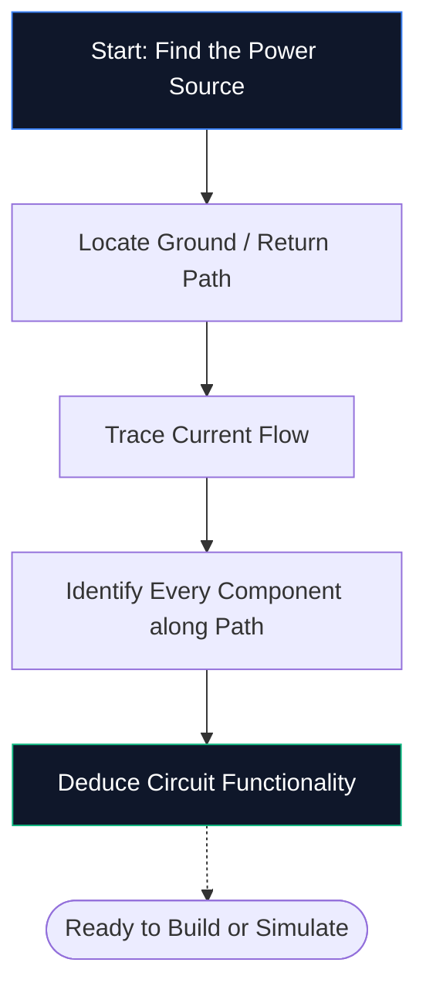

Daha önce hiç şematik editör açmadıysanız ihtiyacınız olan tek rehber bu. Devre şemasının ne olduğu, sembollerin kodunun nasıl çözüleceği ve **Devre Diyagramı Oluşturucu** içindeki ilk şemanızı nasıl çizeceğiniz gibi temel bilgileri tek bir yazılım yüklemeden ele alacağız.

## Devre Şeması Tam Olarak Nedir?

Devre şeması elektrik için bir haritadır. Tıpkı bir metro haritasının tünelleri ölçeklendirmeden istasyonların nasıl bağlandığını göstermesi gibi, bir devre şeması da elektronik bileşenlerin fiziksel boyut veya pano yerleşimi endişesi olmadan nasıl bağlandığını gösterir.

Şemalar, gerçekçi çizimler yerine **standartlaştırılmış semboller** kullanır. Bir direnç zikzak bir çizgi, bir kapasitör iki paralel plaka ve bir diyot da bir çubuğu karşılayan bir üçgen olarak görünür. Bu evrensel kısayol, diyagramların her ülke ve dilde temiz, yazdırılabilir ve okunabilir olmasını sağlar.

> **Soyutlamalar neden önemlidir:** Fiziksel bir direnç renkli bantlara sahip küçük bir silindirdir, ancak 50 bileşenli bir şemada bu ayrıntı görsel kaos yaratacaktır. Semboller resmi sıkıştırır, böylece beyniniz *şeylerin *nasıl göründüklerinden* ziyade *nasıl bağlantı kurduğuna* odaklanabilir.

## Her Yeni Başlayanın Bilmesi Gereken 10 Sembol

Tek bir şemayı okuyabilmeniz veya çizebilmeniz için önce temel yapı taşlarını tanımanız gerekir. Aşağıdaki tabloyu ezberleyin ve çoğu hobi devresini gördüğünüz anda çözebileceksiniz.

| Sembol Şekli | Bileşen | Birincil İşlev | Tanımlayıcı |
| :--- | :--- | :--- | :--- |
| **Zikzak çizgisi** | Direnç | Akım akışını sınırlar | 'R' |
| **İki paralel çizgi** | Kapasitör | Mağaza şarjı, gürültü filtreleri | 'Ç' |
| **Döngü serisi** | İndüktör | Enerjiyi manyetik alanda depolar | 'L' |
| **Üçgen + çubuk** | Diyot | Tek yönde akıma izin verir | 'D' |
| **Üçgen + çubuk + oklar** | LED'ler | İleriye doğru eğildiğinde ışık yayar | 'D' / 'LED' |
| **Uzun / kısa paralel çizgiler** | Pil | DC voltajı sağlar | 'BT' |
| **Üç yığılmış satır** | Zemin | 0 V'de referans noktası | 'GND' |
| **Üçgen şekli** | Op-Amp | Gerilim farkını güçlendirir | 'U' / 'IC' |
| **İğneli dikdörtgen** | Entegre Devre | Karmaşık işlevleri gerçekleştirir | 'U' / 'IC' |
| **Düz çizgiler** | Teller | Bileşenler arasında akım taşıyın | *(Yok)* |

## Beş Adımda Şematik Nasıl Okunur?

Bir devre şemasını okumak her seferinde aynı zihinsel süreci takip eder. Bu beş adımı herhangi bir şema üzerinde uyguladığınızda desen ikinci doğanız haline gelecektir.

1. **Güç kaynağını bulun** — VCC, 5 V veya 3,3 V gibi bir pil sembolü veya etiketi arayın. Elektrik enerjisinin devreye girdiği yer burasıdır.
2. **Toprağı bulun** — Üç satırlı toprak sembolünü veya GND etiketini bulun. Her devrenin bir dönüş yolu olmalıdır.
3. **Akım akışını izleyin** — Kabloları pozitif terminalden her bir bileşene ve toprağa kadar takip edin. Geleneksel akım pozitiften negatife doğru akar.
4. **Her bileşeni tanımlayın** — Her sembolü yukarıdaki tabloyla eşleştirin, ardından kesin değerler için yanındaki etiketi okuyun (örneğin 10 kΩ, 10.000 ohm anlamına gelir).
5. **Amacı anlayın** — Devrenin ne yaptığını kendinize sorun. Bir LED artı bir direnç basit bir gösterge ışığıdır. Geri besleme dirençlerine sahip bir op-amp, bir sinyal amplifikatörüdür.

## İlk Şemanız: LED Devresi

Elektroniğe yeni başlayan herkes buradan başlar; akım sınırlayıcı bir dirençle beslenen bir LED. [Devre Şeması Oluşturucu editörünü](/editor/) açın ve devam edin.

**Devre Mimarisi Boru Hattı:**

```mermaid
graph LR
    PWR(Battery 9V) -- Positive Wire --> R1(Resistor 330Ω)
    R1 -- Controlled Current --> D1((Red LED))
    D1 -- Return Path --> GND(Ground)
    
    style PWR fill:#1e293b,stroke:#f59e0b
    style R1 fill:#1e293b,stroke:#3b82f6
    style D1 fill:#1e293b,stroke:#ef4444
    style GND fill:#1e293b,stroke:#64748b
```

**Adım adım talimatlar:**

1. Kenar çubuğundan **Pil** sembolünü tuvale sürükleyin.
2. Pilin sağına bir **Direnç** yerleştirin.
3. Direncin sağına bir **LED** yerleştirin.
4. Kablo modunu etkinleştirmek için **W** tuşuna basın.
5. Pilin pozitif terminaline tıklayın, ardından bir tel çekmek için direncin sol pimine tıklayın.
6. Direncin sağ pinini LED anoduna bağlayın.
7. LED katotunu tekrar akünün negatif terminaline bağlayın.
8. Direnci çift tıklayın ve **330 Ω** yazın.
9. Yayın kalitesinde bir dosya kaydetmek için **Dışa Aktar → SVG**'ye tıklayın.

## Beş Yaygın Hata (ve Bunlardan Nasıl Kaçınılacağı)

| Hata | Neler Yanlış Gidiyor | Hızlı Düzeltme |
| :--- | :--- | :--- |
| **Yer yolu eksik** | Devre açık görünüyor; akım akamıyor | Her zaman toprağa bir dönüş yolu bağlayın |
| **Noktasız kablo geçişleri** | Çapraz bağlı olmayan iki kablo birbirine bağlı değilken | Yalnızca kabloların gerçekte birleştiği yere bir bağlantı noktası ekleyin |
| **Bileşen değeri yok** | Gözden geçirenler tasarımınızı doğrulayamıyor | Her direnci, kapasitörü ve IC'yi etiketleyin |
| **Dağınık kablolama** | Çapraz veya üst üste binen kablolar okunabilirliği azaltır | Manhattan yönlendirmesini kullanın (yalnızca yatay ve dikey) |
| **Referans göstergeleri yok** | Parça listesi oluşturmak imkansız hale geliyor | Her parçayı R1, C1, U1, D1 vb. olarak etiketleyin |

## Bundan Sonra Nereye Gidilmeli

Temel şemaları çizme konusunda rahat olduğunuzda, seviyenizi yükseltmek için şu kaynakları keşfedin:

* **[Açıklanan Devre Şeması Sembolleri](/blog/circuit-diagram-symbols-explained/)** — her sembol kategorisine ayrıntılı bakış
* **[Çevrimiçi Devre Şeması Nasıl Yapılır](/blog/how-to-make-circuit-diagram-online/)** — gelişmiş teknikler ve iş akışı ipuçları
* **[Bileşen Kitaplığı](/components/)** — Devre Şeması Oluşturucu'da bulunan 40'tan fazla sembolün tümüne göz atın