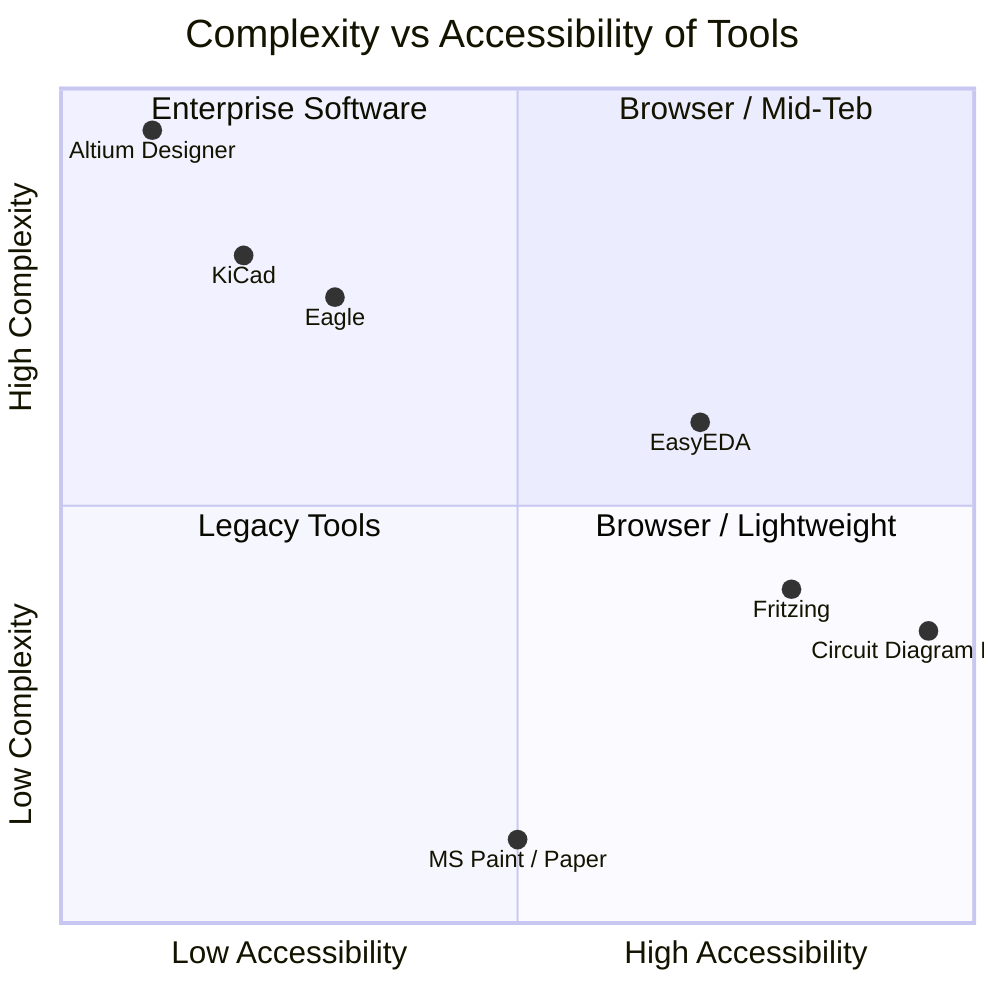
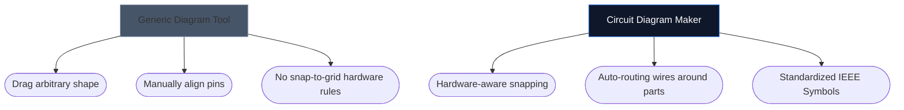

Elektronik şemalarınızı çizmek için doğru aracı seçmek, genellikle yeni bir donanım projesini ne kadar hızlı yineleyebileceğinizi belirleyebilir. Gelişmiş PCB tasarımcıları ağır masaüstü ortamlarına ihtiyaç duyarken hobiciler, öğrenciler ve yapımcılar genellikle tamamen farklı bir şeye ihtiyaç duyar: erişilebilirlik ve hız.

Aşağıda, aracımızın ana sektör alternatifleriyle karşılaştırıldığında nasıl bir performans sergilediğini analiz ediyoruz.

## Takım Sınıflandırma Matrisi

Bireysel araçlara dalmadan önce projenizin gerçekte hangi yazılım seviyesini gerektirdiğini anlamak çok önemlidir. 4 bileşenli bir LED düzeninin taslağını çıkarmak için kurumsal PCB yazılımını kullanmak aşırılıktır.

## 1. Devre Şeması Oluşturucu ve Fritzing

Fritzing, devre tahtası prototiplemesi ile şemalar arasındaki boşluğu doldurmasıyla ünlüdür. Ancak Fritzing kurulum gerektiriyor ve yıllar boyunca bakım güncellemeleriyle uğraştı.

| Özellik | Devre Şeması Oluşturucu | Fritleme |
| :--- | :--- | :--- |
| **Birincil Odak** | Standart Şematik Düzenler | Breadboard Görselleştirmeleri |
| **Kurulum** | Yok (%100 Tarayıcı tabanlı) | Masaüstü Kurulumu Gerekli |
| **Maliyet** | %100 Ücretsiz | Ücretli (Bağış Yazılımı) |
| **Öğrenme Eğrisi** | Son Derece Düşük | Orta |

> **Karar:** Özellikle fizik kablolarının devre tahtasına daldığını görselleştirmeniz gerekiyorsa, Fritzing üstündür. Standart, evrensel elektronik şemalara *anında* ihtiyacınız varsa Devre Şeması Oluşturucuyu kullanın.

## 2. Devre Şeması Oluşturucu ve KiCad ve Altium

KiCad, efsanevi bir açık kaynaklı PCB paketidir ve Altium Designer, kurumsal endüstri standardıdır. Son derece güçlüler.

| Yetenek Katmanı | Devre Şeması Oluşturucu | KiCad / Altium |
| :--- | :--- | :--- |
| **Çıktı Türü** | SVG/PNG Görüntüleri | Gerber Dosyaları, Malzeme Listesi, Seç ve Yerleştir |
| **Simülasyon** | Görsel / Basit | Derin SPICE Entegrasyonu |
| **İlk Şemaya Hızla Geçiş** | < 10 saniye | 10–30 Dakika (Kurulum/Yapılandırma) |

> **Karar:** Shenzhen'deki bir fabrikaya bakır katmanları gönderirken KiCad veya Altium kullanın. Bir fizik ödevine, blog gönderisine veya forum sorusuna şema eklerken Devre Şeması Oluşturucu'yu kullanın.

## 3. Devre Şeması Oluşturucu ve Draw.io / Lucidchart

Draw.io gibi genel diyagram oluşturma araçları akış şemaları için inanılmaz derecede popülerdir. Ancak elektronik konusunda anlamsal anlayıştan yoksundurlar.

Özel bir elektronik araç kullandığınızda editör, bir kablonun bir bağlantı olmadan rastgele bir şekilde "sonlandırılamayacağını" anlar ve doğası gereği standart özellikleri (Ohm'dan dirençlere kadar) eşler.

## Hangi Araç Size Uygun?

En iyi araç, yolunuzdan çekilendir. Hızlı fikir oluşturma, eğitimsel ödevler ve web yayınları için [Circuit Diagram Maker](/editor/), hız ve modern estetiğin rakipsiz bir kombinasyonunu sunar.