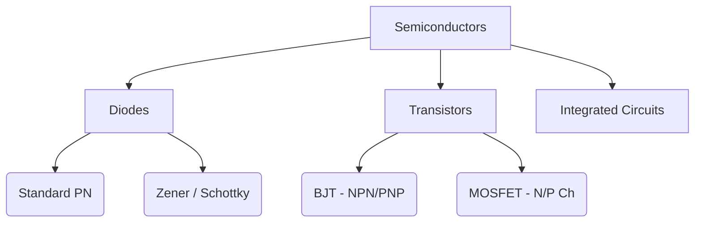

Elektronik semboller donanım mühendisliğinin evrensel dilidir. Tıpkı müzik notalarının perdeyi ve ritmi belirlemesi gibi, devre sembolleri de elektriksel işlevi, özelliği ve bağlantıyı bir kağıt parçası üzerinde aktarır.

Bu kapsamlı kılavuzda herhangi bir şemada karşılaşacağınız en önemli unsurların görsel morfolojisini inceliyoruz.

## Küresel Standart Farklılıkları: IEEE ve IEC

Belirli sembollere dalmadan önce, şemanın çizildiği yere bağlı olarak sembollerin farklı görünebileceğini bilmek çok önemlidir. Baskın iki standart **IEEE/ANSI** (çoğunlukla Amerika) ve **IEC**'dir (Avrupa ve uluslararası).

```mermaid
flowchart LR
    subgraph Regional Standards
    A((Schematic Origin))
    A -- US / Americas --> B[IEEE / ANSI]
    A -- Europe / Int'l --> C[IEC]
    end
    
    B -.-> D(Zigzag Resistors)
    C -.-> E(Rectangle Resistors)
    
    style B fill:#1e293b,stroke:#f59e0b
    style C fill:#1e293b,stroke:#3b82f6
```

Circuit Diagram Maker'da öncelikle IEEE/ANSI standardını kullanıyoruz, çünkü her ikisi de teknik olarak doğru olmasına rağmen dijital ve hobi ekosistemlerinde oldukça popüler olmaya devam ediyor.

## Pasif Bileşenler

Pasif bileşenlerin çalışması için harici bir güç kaynağına gerek yoktur ve bir sinyali yükseltemezler.

| Bileşen | Standart Sembol Görünümü | İşlevsel Açıklama |
| :--- | :--- | :--- |
| **Direnç** | Keskin, pürüzlü bir zikzak çizgisiyle tanımlanır. Değişken varyantlarda çizgiyi delen bir ok bulunur. | Elektrik akımı akışını kısıtlamak için gücü ısı olarak dağıtır. |
| **Kondansatör** | Bir boşlukla ayrılmış iki paralel çizgi. Polarize varyantlar, negatif terminali belirtmek için çizgilerden birini eğirir. | Elektrik enerjisini geçici olarak bir elektrik alanında depolar. |
| **İndüktör** | Tel bobinlerini temsil eden bir dizi yuvarlak halka veya yarım daire. | Enerjiyi manyetik alanda depolayarak akım akışındaki değişikliklere karşı koyar. |

## Aktif Bileşenler (Yarı İletkenler)

Aktif bileşenler bir güç kaynağı gerektirir ve genellikle sinyalleri güçlendirerek elektrik akışını kontrol edebilir.

| Bileşen | Görsel Göstergeler | Temel Kullanım |
| :--- | :--- | :--- |
| **Diyot** | Düz bir çizgiye bakan bir üçgen. Çizgi katodu (negatif) gösterir. | Elektrik için tek yönlü bir vana. |
| **LED** | Işık emisyonunu ifade eden, dışarıyı gösteren iki küçük ok içeren standart bir diyot sembolü. | Görsel göstergeler ve optoelektronik. |
| **BJT Transistör** | Üç bağlantıyla çevrili dikey bir çizgi: taban, toplayıcı ve NPN veya PNP'yi belirten bir ok bulunan bir verici. | Akım kontrollü anahtarlar ve yükselteçler. |
| **MOSFET** | Yalıtılmış geçidi ve dahili alt tabaka diyotlarını vurgulayan ayrılmış sınır çizgileri içerir. | Yüksek güç için voltaj kontrollü anahtarlama. |

## Mekanik ve Çıkış Cihazları

Bu parçalar, insan girdisi alarak veya fiziksel çıktı üreterek fiziksel dünyayla etkileşime girer.

| Bileşen | Şematik Kısayol | Başvuru |
| :--- | :--- | :--- |
| **Anahtar (SPST)** | Devreyi tamamlamak için aşağı doğru dönebilen kırık bir çizgi. | Temel AÇIK/KAPALI güç kontrolü. |
| **Röle** | Genellikle izole edilmiş anahtar kontaklarıyla birleştirilmiş bir indüktör (dahili bobin) olarak tasvir edilir. | Yüksek gerilim yüklerinin alçak gerilim mikrokontrolörleri aracılığıyla anahtarlanması. |
| **Motorlu** | Genellikle belirlenmiş pozitif ve negatif terminallere sahip, 'M' içeren bir daire. | Elektrik akımını dönme kinetiğine dönüştürmek. |

> **Tasarım İpucu:** Mekanik anahtarlar veya röleler kullanırken, yarı iletken bileşenlerinizi voltaj yükselmelerinden korumak için endüktif yüklere daima bir *geri dönüş diyotu* ekleyin!

Bu sembolleri anlamak devre akıcılığına doğru ilk adımdır. Bu şekilleri anında sürüklemek, bırakmak ve denemeler yapmak için [çevrimiçi düzenleyicimize](/editor/) göz atın.