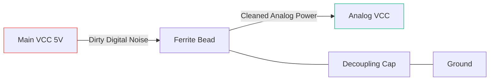

Yüksek hızlı dijital elektronikler çok fazla elektromanyetik gürültü yaratır. Azaltma olmaksızın, bu yüksek frekanslı girişim hassas analog hatlara sızar veya dışarıya doğru yayılır ve cihazınızın FCC emisyon testinde olağanüstü bir şekilde başarısız olmasına neden olur.

Bu müdahaleye karşı birincil silah **ferrit boncuktur**. Şematik sembolünü ve yerleşimini anlamak, devrenizin temiz mi çalıştığını yoksa kendi gürültüsünde mi boğulduğunu belirler.

## 1. Ferrit Boncuk Sembolünün Görselleştirilmesi

Bir ferrit boncuk doğası gereği ağır kayıplı bir indüktör gibi çalışır. Bu nedenle şematik sembolü standart indüktör sembolüyle yakından ilişkilidir, ancak özel rolünü vurgulamak için uyarlanmıştır.

```mermaid
graph LR
    A[Inductor Basis] --> B(Standard Inductor Symbol)
    A --> C(Rectangle Over Wire)
    B -.-> D(Addition of a dashed line or solid bar)
    D --> E[IEEE Ferrite Symbol]
    C --> F[IEC Ferrite Symbol]
    
    style E fill:#0f172a,stroke:#3b82f6
    style F fill:#0f172a,stroke:#10b981
```

| Özellik | IEEE/ANSI Standardı | IEC Standardı | Notlar |
| :--- | :--- | :--- | :--- |
| **Şekil** | Çubuk/kutulu yarım daire serisi | Sağlam bir dikdörtgen blok | Sonuç olarak işlevsel olarak aynı |
| **Tanıtıcı Öneki** | 'FB' | 'FB' veya 'L' | Güç indüktörleriyle karışıklığı önlemek için 'FB' kullanılması önemle tavsiye edilir |
| **Ölçüm Birimi** | Belirli MHz'de Ohm (Ω) | Belirli MHz'de Ohm (Ω) | Henries (H) cinsinden ölçülen indüktörlerin aksine |

> **Önemli Ayrım:** Asla bir ferrit boncuğu endüktansa göre derecelendirmeyin. Ferrit tanecikleri **belirli bir frekanstaki** (tipik olarak 100 MHz) empedansları (Ohm cinsinden) ile belirtilir.

## 2. Temel Operasyonel Mekanikler

Neden standart bir indüktör yerine ferrit boncuk kullanıyorsunuz?

* **İndüktör** enerjiyi depolar ve devreye geri gönderir. Oldukça reaktiftir ve enerjiyi korur.
* Bir **ferrit boncuk** aktif olarak *kayıplı* olacak şekilde tasarlanmıştır. Yüksek frekanslarda bir direnç gibi davranarak istenmeyen yüksek frekanslı gürültüyü doğrudan ısıya dönüştürür.

| Frekans Aralığı | Ferrit Boncuk Davranışı | Devre Sonucu |
| :--- | :--- | :--- |
| **Düşük Frekans / DC** | 1 MHz'in altında | Basit bir tel gibi davranır (~0 Ω). DC gücü serbestçe geçer. |
| **Rezonans Frekansı** | Son Derece Reaktif | Enerjiyi kısa süreliğine depolar. |
| **Yüksek Frekans** | 50 MHz'den fazla | Yüksek değerli bir direnç gibi davranır. RF gürültüsünü ısı olarak engeller ve dağıtır. |

## 3. Şematik Yerleştirme için En İyi Uygulamalar

FB sembolünü doğru şekilde kullanmak stratejik yerleştirme gerektirir. Ferrit boncuklarını şematik olarak rastgele bir şekilde tokatlamak aslında çınlamayı ve rezonansı kötüleştirebilir.

### Güç Kaynaklarının Ayırma (Pi Filtreleri)

Bir 'FB' sembolünün en yaygın kullanımı, kirli dijital gücü temiz analog güçten ayırmaktır.

Yukarıdaki konfigürasyonda (Pi Filtresinin bir parçası), ferrit boncuk yüksek frekanslı geçici akımların AVCC hattına girmesini engellerken, kapasitör kalan dalgalanmaları toprağa yönlendirir.

### Veri Hattı EMI Bastırma

Uzun USB veri kablolarını veya HDMI izlerini yönlendirirken, 'FB' simgeleri genellikle konektörün yanına seri halinde yerleştirilir. Bu, fiziksel olarak açıkta kalan uzun kablonun anten görevi görmemesini ve CPU gürültüsünü odaya yaymamasını sağlar.

Bir sonraki şemanıza bir ferrit boncuk eklemek için **[Devre Şeması Düzenleyicisi](/editor/)**'i açın, "Ferrit" ifadesini arayın ve empedans derecenizi belirtin!