12V araba aküsünü ev aletlerini çalıştırabilecek 220V alternatif akıma dönüştüren bir güç invertörü oluşturmak, elektronik mühendisleri için bir geçiş törenidir.

Bir havyayı kaldırmadan önce, alttaki şemayı kusursuz bir şekilde anlamalısınız. Yüksek voltaj devresi affedilmezdir ve kötü çizilmiş bir şema, MOSFET'lerin yanmasını veya ciddi elektrik çarpmasını garanti eder. Bu kılavuz temel bir kare dalga invertörün mimarisini açıklamaktadır.

> **Güvenlik Uyarısı:** 220V AC gücü öldürücüdür. Bu makale bir imalat planı değil, şematik mantık ve teorik tasarımın bir incelemesidir. İleri düzeyde elektrik eğitimi almadan asla yüksek gerilim devreleri kurmayın.

## Üç Sütunlu Mimari

Modern bir invertör ne kadar karmaşık olursa olsun şematik her zaman görsel ve mantıksal olarak üç farklı işlevsel bloğa bölünebilir.

```mermaid
flowchart LR
    DC_SRC[(12V DC Battery)] --> OSC[1. Oscillator Block]
    OSC -- Low Power Square Wave --> AMP[2. Power Switch Block]
    AMP -- High Current 12V Wave --> TX[3. Step-Up Transformer]
    TX -- Magnetic Induction --> AC_OUT((220V AC Output))
    
    style OSC fill:#0f172a,stroke:#3b82f6
    style AMP fill:#0f172a,stroke:#f59e0b
    style TX fill:#0f172a,stroke:#ef4444
```

### Aşama 1: Osilatör (Beyinler)

Pilden gelen Doğru Akım (DC) düz bir çizgide akar. Transformatörler düz bir çizgiyi yükseltemez; dalgalanan manyetik alanlara ihtiyaç duyarlar. Bu nedenle DC'yi yapay bir AC dalgasına (coğrafi bölgeye bağlı olarak tipik olarak 50Hz veya 60Hz) dönüştürmeliyiz.

| Kullanılan Bileşen | Şematik Rol | Neden Seçildi |
| :--- | :--- | :--- |
| **CD4047 IC / 555 Zamanlayıcı** | Kararsız Multivibratör | Bir RC zaman sabiti hesaplayarak son derece kararlı bir kare dalga çıkışı sağlar. |
| **Direnç ve Kapasitör Ağı** | Zamanlama kalibratörleri | Değerler (örneğin, 'R=100kΩ', 'C=0,1μF') kesin 50Hz frekansını benzersiz bir şekilde belirler. |

### Aşama 2: Güç Anahtarları (Kas)

Mantık çipi, olağanüstü derecede düşük akım limitlerinde (genellikle 20mA'nın altında) saf 50Hz'lik bir dalga üretir. Bunu bir transformatöre beslerseniz, bir ampulü çalıştırmaya yetecek kadar manyetik akı üretmez.

Osilatör ile transformatör bobinleri arasına yüksek güçlü transistörler yerleştiriyoruz.

1. Osilatörün zayıf sinyali devasa bir N-Kanal MOSFET'in (IRF3205 gibi) **Kapısına** çarpar.
2. MOSFET, elektronik ağır hizmet rölesi görevi görür.
3. 12V aküden gelen devasa amperajı saniyede 50 kez doğrudan transformatör bobinleri aracılığıyla hızlı bir şekilde değiştirir.

### Aşama 3: Yükseltici Transformatör

Şematikteki bu noktada, ileri geri titreşen büyük miktarlarda 12V akım var. Son aşama, bunun bir transformatörün birincil bobinleri aracılığıyla yönlendirilmesini gerektirir.

| Özellik | Şematik Ayrıntılar | Gerçek Dünya Uygulaması |
| :--- | :--- | :--- |
| **Birincil Bobin (Sol)** | Ortadan kılavuzlu konfigürasyon (`12V - 0 - 12V`) | İki alternatif MOSFET'ten ileri-geri itme-çekme geçişine izin verir. |
| **Temel Hatlar** | Dikey olarak çizilmiş iki düz çizgi | Yüksek verimli manyetik indüksiyon için gerekli olan demir/ferrit çekirdeği temsil eder. |
| **İkincil Bobin (Sağ)** | Muazzam derecede arttırılmış sarım oranı | Fizik, darbeli 12V manyetik akıyı ölümcül, uçucu bir 220V dalgaya yükseltir. |

## Çizimde Dikkat Edilmesi Gerekenler

Bu tasarımın taslağını çıkarmak için **[Devre Şeması Düzenleyicisi](/editor/)**'i kullanırken en iyi düzen uygulamalarını unutmayın:

* 12V Akü akımını taşıyan kalın çizgileri, düşük güçlü osilatör çizgilerinden daha kalın çizin.
* MOSFET Kaynak pinlerini açık ve benzersiz bir şekilde topraklayın; Gürültü eşleşmesini önlemek için bunları hassas osilatörün topraklamasına yakın bir yere yönlendirmeyin.
* 220V çıkışlarını grafiksel olarak tanımlayın! Boşlukta biten çıplak kablolar bırakmak yerine uyarı etiketleri ve çıkış bağlantı noktalarını (soket sembolü gibi) yerleştirin.