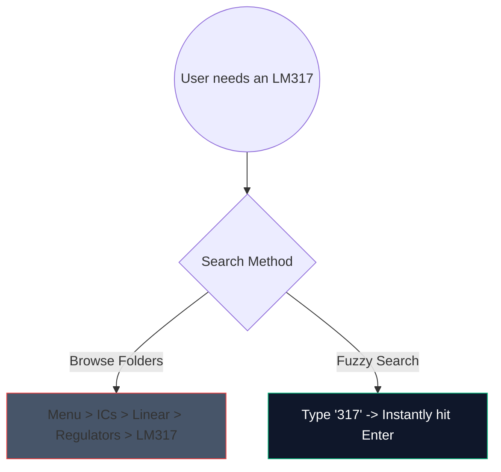

Basit bir amplifikatör devresi taslağı oluşturmak için ağır, 2 gigabaytlık masaüstü yazılımı indirme günleri artık geride kaldı. Tarayıcı tabanlı CAD (Bilgisayar Destekli Tasarım) burada ve olağanüstü derecede hızlı.

5 dakikadan kısa sürede üretim kalitesinde şemalar oluşturmak için modern web araçlarını tam olarak nasıl kullanabileceğinizi burada bulabilirsiniz.

## Neden Tarayıcı Tabanlı Devre Tasarımı?

Bir eğitimci, öğrenci veya belge yazma hobisi iseniz, hız ve erişilebilirlik ham özelliklerin önüne geçer.

```mermaid
flowchart LR
    subgraph Traditional Workflow
    DL[Download/Install] --> CONF[Configure Libraries] --> DRAW1[Draw]
    end
    
    subgraph Web Workflow
    URL[Go to URL] --> DRAW2[Draw immediately]
    end
    
    style URL fill:#0f172a,stroke:#3b82f6
    style DRAW2 fill:#1e293b,stroke:#10b981
```

| Metrik | Masaüstü Uygulaması | Devre Şeması Oluşturucu |
| :--- | :--- | :--- |
| **Depolama Alanı** | 1GB - 5GB+ | 0 MB (Bulut tabanlı) |
| **İşletim Sistemi Uyumluluğu** | Genellikle yalnızca Windows veya hatalı bağlantı noktaları | Evrensel Web uyumlu |
| **Başlatma Zamanı** | 15–30 saniye | < 1 saniye |
| **Taşınabilirlik** | Tek bir makineyle sınırlı | Her yerden erişilebilir |

## Hız için Temel İş Akışı Hack'leri

Bir web düzenleyici kullanırken klavye kısayollarını kullanmak, deneyimi "etrafına tıklamaktan" kesintisiz bir akış durumuna dönüştürür.

Editörümüzde ezberlemeniz gereken en yüksek yatırım getirisi sağlayan kısayollar şunlardır:

| Eylem | Kısayol Komutu | İş Akışı Avantajı |
| :--- | :--- | :--- |
| **Kablo Yönlendirme** | 'W' | İmlecinizi anında bağlantı moduna geçirerek bir araç çubuğuna gitmeden hızlı ağ yönlendirmesine olanak tanır. |
| **Bileşen Döndürme** | 'R' (parçayı tutarken) | Dirençleri veya transistörleri yerleştirmeden önce yönlendirmek, daha sonra yapılacak temizlik işlemlerinden büyük miktarda tasarruf etmenizi sağlar. |
| **Çoğaltılmış Seçim** | 'Ctrl + D' veya 'Alt-Sürükle' | Menüden 8 LED'i çekmeyin; birini yerleştirin, yapılandırın ve anında 7 kez çoğaltın. |
| **Pan Kanvas** | 'Boşluk Çubuğu + Sürükle' | Devasa, karmaşık düzenlerde gezinirken yakınlaştırma düzeyinizi tutarlı tutar. |

## Bileşen Aramayı Kullanma

Büyük açılır menüler arasında görsel olarak arama yapmak sıkıcıdır. Sağlam bir bulanık arama mekanizması entegre ettik.

'Yarı İletkenler -> Transistörler -> BJT'ye tıklamak yerine arama çubuğuna basın ve 'NPN' yazın. Araç anında en yüksek olasılıklı eşleşmeyi seçer.

## Profesyonel Kullanım için Dışa Aktarma

Diyagramı oluşturmak işin yalnızca yarısıdır; bunu tezinize veya teknik blogunuza enjekte etmek diğer yarısıdır.

Devre modellerinizi PNG veya JPG yerine daima **SVG (Ölçeklenebilir Vektör Grafikleri)** olarak dışa aktarın. SVG, pikseller yerine matematiksel olarak tanımlanmış çizgileri saklar; bu, şematiklerinizi reklam panosu boyutuna kadar ölçeklendirebileceğiniz ve rasterleştirme bulanıklığı olmadan sürekli olarak son derece keskin kalacağı anlamına gelir.

Hızınızı test etmeye hazır mısınız? **[Uygulamayı başlatın](/editor/)** ve 555 zamanlayıcılı yanıp sönen LED devresi oluşturmayı deneyin!