Karmaşık bir şemayı ilk kez açmak, yabancı bir dile bakıyormuş gibi hissettiriyor. Düzinelerce kesişen çizgi, şifreli kısaltmalar ve sivri uçlu semboller görsel bir gürültü duvarında birleşiyor.

Ancak deneyimli mühendisler şemaları sayfanın tamamına bakarak okumazlar. İzole ederler, izlerler ve fethederler. Herhangi bir devre şemasını çözmek için adım adım metodolojiyi burada bulabilirsiniz.

## Adım 1: Çekirdek Güç Altyapısını Yalıtın

Bir devrenin *ne yaptığını* anlamadan önce *nasıl nefes aldığını* anlamalısınız.

Her şemanın elektrik enerjisi için giriş noktaları vardır. İlk göreviniz tüm ana gerilim raylarını ve toprak referanslarını bulmaktır.

```mermaid
flowchart TD
    A[Start: Scan Edges] --> B{Look for Power Symbols}
    B -- Found Battery/Jack --> C[Trace the initial VCC and GND lines]
    B -- Found Net Labels --> D[Locate generic +5V, +3.3V pads]
    C --> E[Are there Voltage Regulators?]
    D --> E
    E -- Yes --> F[Mentally divide circuit into Voltage Zones]
    E -- No --> G[Circuit runs on single voltage]
    
    style A fill:#0f172a,stroke:#3b82f6
    style F fill:#1e293b,stroke:#f59e0b
```



| Sembol/Metin | Anlamı | Eylem Gereksinimi |
| :--- | :--- | :--- |
| 'VCC' / 'VDD' | IC'ler için pozitif besleme voltajı. | Her IC'nin güç aldığından emin olmak için bunu izleyin. |
| 'GND' / 'VSS' | Ortak zemin referansı. | Tüm bu sembollerin fiziksel olarak birbirine bağlandığını varsayalım. |
| 'LDO' / 'para' | Gerilimi düşüren bir çip. | Yeni düşük voltajı kullanarak hangi bileşenlerin akış aşağı olduğuna dikkat edin. |

## Adım 2: "Beyinlerin" (IC'ler) gizemini aydınlatın

Gücün nereye aktığını öğrendikten sonra sayfadaki en büyük dikdörtgenleri arayın. Entegre Devreler (IC'ler), şemanın birincil işlevini belirler.

'NE555' veya 'ATmega328P' gibi şifreli parça numarasına sahip 'U1' etiketli bir IC ile karşılaşırsanız şemayı okumayı hemen bırakın. Yeni bir sekme açın ve **veri sayfasını** çekin.

Dahili yarı iletken fiziğini anlamanıza gerek yok; veri sayfasının "Pinout Diyagramına" bakmanız yeterlidir. Pim 4 "RESET" ve pim 8 "VCC" ise, bu mantığı hemen çizime geri eşleştirin.

## Adım 3: Giriş ve Çıkışları Takip Edin

Devreler işlevsel makinelerdir. Çevresel girdiyi alırlar, işlerler ve bir sonuç çıkarırlar.

```mermaid
quadrantChart
    title Input/Output Hardware Identification
    x-axis Analog/Physical --> Digital/Data
    y-axis Input Devices --> Output Devices
    quadrant-1 Digital Receivers (e.g. WiFi)
    quadrant-2 Digital Displays (e.g. OLEDs)
    quadrant-3 Physical Actuators (e.g. Motors)
    quadrant-4 Physical Sensors (e.g. Thermistors)
    "Push Button": [0.1, 0.4]
    "Photoresistor": [0.2, 0.2]
    "UART RX": [0.8, 0.4]
    "UART TX": [0.8, 0.6]
    "Speaker": [0.3, 0.8]
    "LED": [0.4, 0.7]
```

Kabloları merkezi IC'lerden dışarıya doğru izleyin. Bir IC pini bir LED'e bağlanırsa, bu görsel bir çıkıştır. Bir pin, toprağa giden bir SPST anahtarına bağlanırsa, bu bir insan girişidir.

## Adım 4: Kavşakları ve Geçişleri Doğrulayın

Yeni başlayanlar için en yaygın okuma hatası, birbiriyle kesişen tellerin yanlış anlaşılmasıdır.

* **Bir Nokta Bir Düğüm Verir:** Kesişen iki çizginin kesişiminde düz bir nokta varsa, bunlar fiziksel olarak birbirine lehimlenir/bağlanır. Aralarında akım geçebilir.
* **Hiçbir Nokta Köprü Oluşturmaz:** İki çizgi düz bir çarpı işareti (+) oluşturuyorsa, *değişmezler*. Üst geçitte birbirinin üzerinden geçen iki otoyol gibidirler.

## Adım 5: Alt Devreleri Tanıyın (Gizli Silah)

Mühendisler nadiren devreleri tamamen sıfırdan tasarlarlar. Standart modüler alt devreleri birbirine yapıştırırlar. Bu görsel 'kelimeleri' tanımayı öğrendiğinizde, tek tek 'harfleri' okumayı bırakırsınız.

| Görsel Desen | Standart Alt Devre | İşlev |
| :--- | :--- | :--- |
| Kondansatör, IC'nin hemen yanında 'VCC'den 'GND'ye geçiyor. | **Dekuplaj Kondansatörü** | Gürültüyü emer. Mantıksal akışı analiz ederken bunu göz ardı edin. |
| '+5V'ye kadar sarılan dijital pimden gelen direnç. | **Yukarı Çekme Direnci** | Yüzen pimleri önler; istikrarlı bir YÜKSEK varsayılan durum sağlar. |
| Gerilim ile toprak arasına seri olarak yerleştirilmiş, ortasından bağlantı yapılmış iki direnç. | **Gerilim Bölücü** | Sensör pimi tarafından güvenli bir şekilde okunabilmesi için voltajı orantılı olarak düşürür. |

Bu teoriyi uygulamaya koyun. **[Devre Şeması Düzenleyicisi](/editor/)**'i açın, bir şablon yükleyin ve gücü, beyni, girişleri ve çıkışları kendiniz haritalayın!