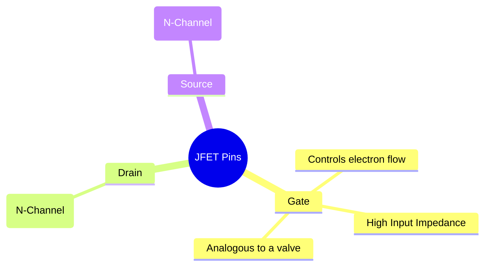

MOSFET'lerin büyük çapta yayılmasından önce, **JFET** (Kavşak Alan Etkili Transistör), yüksek giriş empedansı amplifikasyonunun kralıydı. Modern dijital mantıkta bu kadar sık ​​kullanılmasa da, yüksek kaliteli ses ön yükselticilerinde, hassas enstrümantasyonda ve RF devrelerinde vazgeçilmez eserler olmaya devam ediyorlar.

JFET şematik sembolünü anlamak, ayrık analog devre tasarımını araştıran herkes için çok önemlidir.

## 1. JFET Sembolünün Anatomisi

Akım kontrollü cihazlar olan Bipolar Bağlantı Transistörlerinin (BJT'ler) aksine, JFET **voltaj kontrollü** bir cihazdır. Şematik sembol, dahili yarı iletken kanalının fiziksel yapısını görsel olarak temsil etmeye çalışır.

Sembol, kanalı temsil eden düz bir dikey çizgiden ve ona bağlanan iki yatay çizgiden (Boşaltma ve Kaynak) oluşur. Yarı iletken polaritesini belirleyen bir okla tamamlanan üçüncü bir dikey çizgi Geçidi oluşturur.

### N-Kanal ve P-Kanal JFET'ler

Tıpkı BJT'lerin NPN ve PNP'ye sahip olması gibi, JFET'lerin de iki farklı çeşidi vardır.

| karakteristik | N-Kanal JFET | P-Kanal JFET |
| :--- | :--- | :--- |
| **Sembol Oku** | **IN** kanal çizgisine doğru işaret eder | **OUT** kanaldan uzaktaki noktalar |
| **Çoğunluklu Taşıyıcılar** | Elektronlar | Delikler |
| **Pinch-Off için Vgs** | Negatif Gerilim (örn. -5V) | Pozitif Gerilim (örn. +5V) |
| **Tipik Çalışma**| Normalde AÇIK -> KAPALI konuma getirmek için negatif voltaj dizisi uygulayın | Normalde AÇIK -> KAPALI konuma getirmek için pozitif voltaj dizisi uygulayın |

> **Hafıza Hilesi:** "İÇİ Gösterme", **N**-Kanal anlamına gelir. Kapıdaki oka bakın. Eğer çizginin içine doğru işaret ediyorsa, bir N-Kanal JFET (popüler 2N5457 gibi) ile karşı karşıyasınız demektir.

## 2. Operasyon: Tükenme Modu

JFET'in en tanımlayıcı özelliklerinden biri **Tükenme Modu** cihazı olmasıdır. Bu, onların etrafındaki şemaları nasıl tasarladığınızı büyük ölçüde etkiler.

* **MOSFET'ler (Geliştirme Modu):** Normalde KAPALI'dır. Bunları açmak için kapıya voltaj uygulamanız gerekir.
* **JFET'ler (Tükenme Modu):** Normalde AÇIK'tır. Kapıdaki 0 ​​Volt ile, Drenajdan Kaynağa maksimum akım akar. Tükenme bölgesini genişletmek ve kelimenin tam anlamıyla elektron akışını "sıkıştırmak" ve cihazı KAPALI konuma getirmek için bir *ters öngerilim* voltajı (N-Kanal için negatif) uygulamanız gerekir.

```mermaid
flowchart LR
    VGS[V_GS = 0V] --> I1[Maximum Drain Current flows]
    VGS2[V_GS = -2V] --> I2[Current is restricted]
    VGS3[V_GS = -5V] --> I3[Pinch-Off reached. Circuit is OFF]
    
    style VGS fill:#1e293b,stroke:#f59e0b
    style VGS3 fill:#1e293b,stroke:#ef4444
```

## 3. Tipik Şematik Uygulamalar

Bir JFET'in Kapısı çalışma sırasında ters kutuplu olduğundan, aslında içine sıfır akım akar. Bu, astronomik derecede yüksek bir giriş empedansı sağlar (genellikle yüzlerce Megaohm cinsinden ölçülür).

| Devre Uygulaması | Neden JFET'ler Seçiliyor | Şematik İpuçları |
| :--- | :--- | :--- |
| **Ses Ön Yükselticileri** | Son derece düşük gürültü ve devasa giriş empedansı, hassas elektro gitar manyetiklerinin yüklenmesini önler. | Çoğunlukla Kaynak Takipçisi arabellek aşaması olarak görülür. |
| **Analog Anahtarlar** | Tamamen voltaj kontrollü olduğundan ve geçit akımı olmadığından, sinyal yoluna sıfır anahtarlama geçişlerini enjekte ederler. | Drenaj kaynağı kanalından geçen analog sinyalle seri olarak yerleştirilir. |
| **Sabit Akım Kaynakları** | Bir JFET, kapı doğrudan kaynağa bağlandığında doğal olarak sabit bir akım havuzu gibi davranır. | Kapı terminali doğrudan Kaynak terminalinin çevresine kablolanmıştır. |

Bu özel analog devrelerin diyagramını çizerken hassasiyet çok önemlidir. Üretim hatalarını önlemek için Kapı ok yönünün doğru olduğundan emin olun. Standart N-Kanal ve P-Kanal JFET sembollerini bir sonraki tuvalinize doğru bir şekilde yerleştirmek için **[Devre Diyagramı Oluşturucusu](/editor/)** içindeki seçilmiş ayrık yarı iletken kitaplığını kullanın.