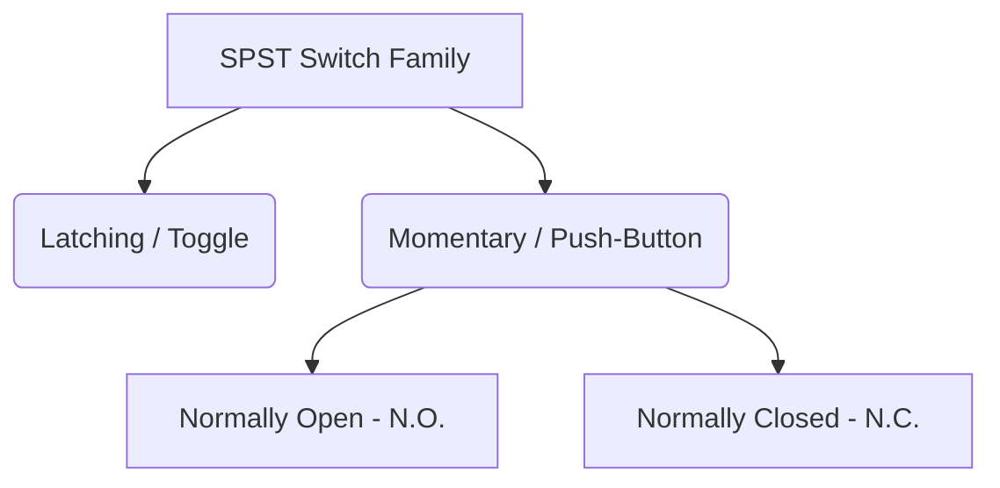

İnsanların elektriği kontrol etmek için kullandığı her arayüzün merkezinde mekanik anahtar yatıyor. Bu bileşenin en basit, en yaygın örneği **SPST** veya Tek Kutuplu Tek Atışlı anahtardır.

İster yüksek voltajlı bir güç şebeke kesicisi tasarlıyor olun, ister Arduino devre tahtası üzerinde bir düğmeyi haritalandırıyor olun, SPST sembolü mantıksal başlangıç ​​noktanızdır.

## 1. SPST'nin Aslında Anlamı

Mühendisler anahtarları iki değişken kullanarak sınıflandırır: **Kutuplar** ve **Atarlar**.

* **Kutup (P):** Anahtarın aynı anda kontrol edebileceği bağımsız elektrik devrelerinin sayısı. 
* **Atış (T):** Her kutbun sahip olduğu kapalı durumların (AÇIK konumları) sayısı.

Bu nedenle, SPST bir *Tek Kutupludur* (bir devreyi kontrol eder) ve *Tek Atışlıdır* (yalnızca bir kapalı, iletken konuma sahiptir).

```mermaid
flowchart LR
    A[Human Input] --> B((SPST Mechanism))
    B -- Open / Default --> C[Infinite Resistance / OFF]
    B -- Closed / Actuated --> D[Zero Resistance / ON]
    
    style B fill:#0f172a,stroke:#f59e0b
```

## 2. SPST Şematik Sembolünün Okunması

Bir SPST anahtarının standart IEEE sembolü son derece sezgiseldir; kelimenin tam anlamıyla yaptığı şeye benzer.

| Görsel Öğe | Gerçek Dünyada Anlamı |
| :--- | :--- |
| **İki Açık Daire** | Kabloların sonlandığı sabit elektrik kontak pedleri. |
| **Çapraz Kırık Çizgi** | Mekanik iletken kol, 'Açık' varsayılan durumunu belirtmek için ikinci pedden fiziksel olarak ayrılmıştır. |
| **Gösterge (`S` veya `SW`)** | Standart referans etiketleri. örneğin, 'SW1'. |

> **Normal Durum Varsayımı:** Aksi belirtilmedikçe, mekanik anahtarlar **aktüelleştirilmemiş, dinlenme durumunda** çekilir. Standart bir SPST ışık anahtarı için bu, şemanın onu KAPALI olarak gösterdiği anlamına gelir.

## 3. SPST'nin Çeşitleri: Düğmeler

Bir geçiş anahtarı koyduğunuz yerde kalır (mandallama). Bir basma düğmesi yalnızca parmağınız üzerindeyken (anlık) etkinleşir. SPST tanımı her ikisi için de geçerlidir ancak semboller, insan etkileşimi modlarını ayırt etmek için biraz değişir.

| Anahtar Türü | Şematik Değişiklik | Gerçek Dünya Örneği |
| :--- | :--- | :--- |
| **Basmalı Düğme (N.O.)** | Açılı bir kol yerine, iki temas yüzeyinin *üzerinde* düz bir köprü asılı duruyor. Aşağıya doğru bastırmak boşluğu kapatır. | Klavye tuşları, bilgisayar güç düğmeleri, kapı zili düğmeleri. |
| **Basmalı Düğme (N.K.)** | Düz köprü pedlerin *altında* veya temas halinde durur ve devreyi varsayılan olarak AÇIK tutar. Aşağıya doğru bastırmak bağlantıları koparır. | Ağır makinelerde Acil Durdurma (E-Stop) düğmeleri. |

## 4. Donanım Uygulama Uyarıları

Bir SPST anahtarını dijital bir mantık devresine (Raspberry Pi GPIO pini gibi) dahil ederken, saf bir şematik tasarım, felaket derecede öngörülemeyen yazılım davranışına yol açacaktır.

### "Kayan Pim" Sorunu

SPST anahtarının bir ucunu 5V'a, diğer ucunu da doğrudan mikrodenetleyici pinine bağlarsanız anahtar açık olduğunda ne olur? Pim 0V okumuyor; bağlantısı kesilmiş ve "yüzüyor", çevredeki elektromanyetizmayı toplayan bir anten gibi davranıyor.

**Çözüm: Aşağı Açılan Dirençler**

Daima dijital pin ile Toprak arasına bağlı bir direnç (tipik olarak 10kΩ) ekleyin.

1. **Kapatma:** Pim, direnç üzerinden güvenli bir şekilde 0V okur.
2. **AÇIK:** 5V besleme, dirence aşırı güç vererek güvenli bir YÜKSEK durumu tetikler.

**[Devre Şeması Düzenleyicisi](/editor/)** aracılığıyla SPST çeşitlerini tasarımlarınıza güvenli bir şekilde ekleyin. N.O.'yu bulmak için sol 'Anahtarlar' kitaplığını genişletin. ve N.C. uygulamaları!