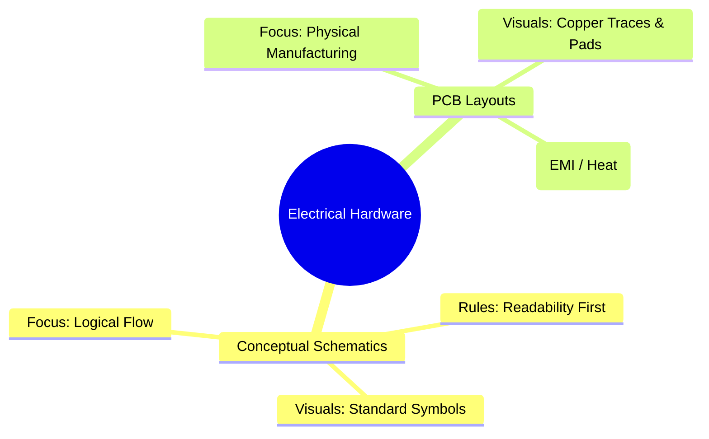
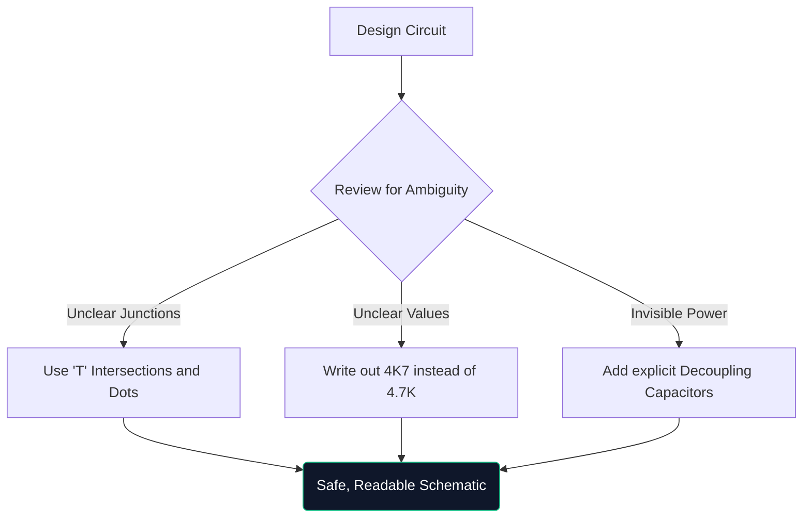

Devre şemaları üzerine eksiksiz bir ustalık sınıfına hoş geldiniz. İster bir hafta sonu Arduino prototiplerini bir araya getiriyor olun ister elektrik mühendisliği okuyor olun, şematik mimariyi anlamak tartışılamaz.

Bu kılavuz, modern diyagramların nasıl oluşturulduğunu, doğrulandığını ve üretildiğini değerlendirerek temel bilgilerin ötesine geçer.

## Teorik Şemalar ve PCB Yerleşimleri

Çok yaygın bir kafa karışıklığı noktası, şematik diyagram ile Baskılı Devre Kartı (PCB) düzeni arasındaki farktır. Bunlar aynı elektriksel gerçeğin tamamen farklı temsilleridir.

| Özellik | Şematik Diyagram | PCB Düzeni |
| :--- | :--- | :--- |
| **Amaç** | Devrenin mantıksal olarak *nasıl* çalıştığını anlamak için | Bakırın fiziksel olarak *nereye* gideceğini belirlemek için |
| **Bileşen Temsili** | Soyut semboller (üçgenler, zikzaklar) | Fiziksel 1:1 ayak izi pedleri (örn. SOIC-8, 0805) |
| **Bağlantılar** | Mükemmel geometrik çizgiler | 45 derecelik açılı bakır izleri |
| **Çevre** | Temiz, beyaz arka plan kağıdı | Çok katmanlı gerçek 3D alan |

## Gelişmiş Bir Şemanın Anatomisi

Devreler 100 bileşenin ötesine geçtiğinde görsel paradigmalar değişir. Her şeyi çekilmiş kablolarla kolayca bağlayamazsınız.

1. **Başlık Blokları**: Profesyonel şemalarda her zaman sağ alt köşede Şirket Adı, Kayıtlı Mühendis, Revizyon Numarası ve Tarihi belirten bir blok bulunur.
2. **Ağ Etiketleri ve Bağlantı Noktaları**: Kablolar alt sistemleri bağlamaz; adlandırılmış etiketler bunu yapar. İki kablo 'CLK_OUT' olarak etiketlenmişse, farklı sayfalarda olsalar bile elektriksel olarak bağlıdırlar.
3. **Hiyerarşik Bloklar**: Devasa tasarımlar (bilgisayar anakartı gibi) hiyerarşiyi kullanır. "Bellek Arayüzü" etiketli tek bir dikdörtgen blok, içinde tamamen ayrı bir şematik sayfa içerir.

## "Savunma Çizimi" Kuralı

Defansif sürüşe benzer şekilde, defansif çizim, şemanızı okuyan kişinin siz onlara açıkça rehberlik etmedikçe onu yanlış anlayacağını varsaymak anlamına gelir.

> **Neden '4K7' yazıyorsunuz?** Basılı veya fotokopi şemalarda, küçük bir ondalık nokta (`.`) artefaktlardan dolayı kolayca kaybolur. '4.7K' yazmak, birisinin bunu '47K' olarak okumasına neden olabilir ve bu da bileşeni kızartabilir. '4K7' yazmak, çarpanın ondalık nokta gibi davranmasını sağlayarak yanlış okumaları neredeyse ortadan kaldırır.

## Dijital CAD Araçlarına Geçiş

Grafik kağıdı üzerine çizim yapmak beyin fırtınası için mükemmeldir ancak üretim için pratik olarak işe yaramaz. Tasarımlarınızı [Devre Şeması Oluşturucu](/editor/) gibi bir araca taşıdığınızda birkaç süper güç kazanırsınız:

* **Netlists**: Dijital araçlar bağlantıları matematiksel olarak kanıtlar.
* **Yeniden Kullanılabilirlik**: Önceki projelerden alınan karmaşık düzenlenmiş güç kaynaklarının kopyalanıp yapıştırılması saat tasarrufu sağlar.
* **Vektör Kalitesi**: SVG olarak dışa aktarma, ne kadar yakınlaştırırsanız yakınlaştırın, mükemmel netlikte çizgiler garanti eder.

Teoriden gerçeğe geçiş, iyi çizilmiş bir çizgiyle başlar. Yolculuğunuza bugün başlayın!